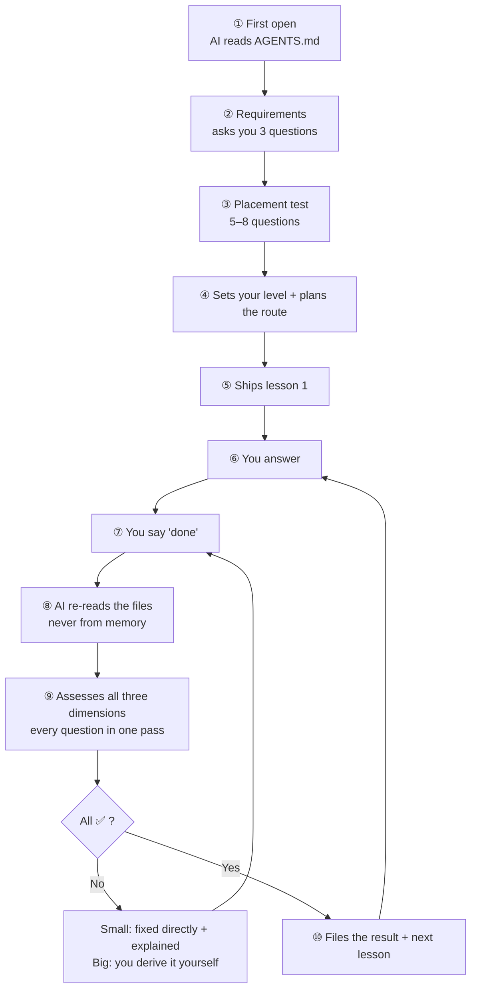

# Steps2Great

[](https://github.com/wildcat430524/Steps2Great/actions/workflows/check.yml)
[](./LICENSE)
[](./LICENSE-DOCS)
[](./CONTRIBUTING.md)

**Open this folder and you get a one-on-one tutor.**

A Markdown protocol — any AI tool that opens it becomes your personal teacher:
it runs a placement test, teaches lessons, grades your work, explains *what you got wrong and why*,
then records your progress so you can pick up where you left off.

**Nothing to install for the learner.** No Node, no npm, no API key, no account.

[简体中文](./README.md) | English

---

## Why this exists

AI is already good enough to teach. **What was always missing isn't content — it's someone watching you.**

| Your current situation | How Steps2Great fixes it |
|---|---|
| You ask an AI "how do I learn Python?" — it hands you a roadmap, and then… nothing | The AI runs a placement test → finds your real level → plans the route → **ships lesson 1** |
| You finish a lesson; nobody checks whether you actually got it | Three-dimension assessment: **all ✅ before you may advance** |
| You get something wrong; the AI says "not quite" — and you still don't know where | Small mistakes are **fixed for you**, with the full "what you wrote → what's wrong and why → what I changed it to" |
| Close the chat and it forgets everything | State is written to files: **switch tools, come back a month later, keep going** |
| Switch AI tools and lose all your history | Your data is plain Markdown — **portable across any tool** |

### Versus just asking an AI

| | Just asking an AI | Steps2Great |
|---|---|---|
| Persona | You re-explain "you're my teacher" every time | ✅ Baked into `AGENTS.md` — zero cost |
| Remembers your progress | ❌ Context only; gone when closed | ✅ Written to `我的学习/00-学习档案.md` |
| Makes you practise | ❌ Only answers when asked | ✅ Sets questions → waits for "done" → assesses |
| Points out your mistakes | ⚠️ Usually just gives the right answer | ✅ Three-part explanation, separating slips from real gaps |
| **Probes your actual needs** | ❌ You say "teach me English" and it just starts | ✅ **Keeps asking until it's sure it understands you** |
| Switching tools | ❌ History lost | ✅ Works anywhere |
| Who owns the data | The platform | ✅ Your own folder |

### Why the results differ: the AI keeps probing until it truly understands you

The biggest problem with an ordinary AI isn't bad answers — it's that **it never checks whether it understood you correctly**.
You say "teach me English" and it starts teaching. Teach *whom*? For an exam or for conversation? How long can you study per day? What's your level? It knows none of this — and **it doesn't ask**.

This project writes "**probe until confirmed**" into the protocol. On first contact, the AI sounds like this:

```
You: Teach me English.

AI:  Before we start, I need to be sure I actually understand you —
     I'll keep going until I can restate your goal back to you.

     1. "Learn English" — for what exactly?
        a) An exam (CET / IELTS / grad school)
        b) Speaking and conversation
        c) Reading papers / watching shows
     2. What's your current level? Open any English article, read for 30 seconds,
        and tell me roughly how much you understood.
     3. How much time can you *reliably* invest per day? (Give the real number,
        not the ideal one — I'll plan lessons around it.)

… (you answer, and the AI restates what it understood) …

AI:  Here's the goal as I understand it —
     "Pass CET-6 within 4 months; currently ~50% reading comprehension;
      40 minutes a day, more on weekends. Prioritise reading and listening,
      sprint writing before the exam."

     Right? Correct me if anything is off. **I won't start teaching until you confirm.**
```

**The key design point**: the probing isn't small talk — it's **disambiguation**. Every answer becomes
an input to the placement test and the course route. When you later ask "why is the course ordered this way?",
the answer traces back to what you confirmed on day one.

> This probing behaviour is written into `AGENTS.md` too — **whatever AI tool you use, it will ask the same way**.

---

## Who it's for — and who it's not for

**Said up front, so you don't waste a download.**

| ✅ Good fit | ❌ Not a fit |
|---|---|
| Self-studying a skill, but always quitting halfway | Wanting ready-made course videos / textbooks — **this project ships no content** |
| Wanting someone to watch you and check your work | Wanting a "ask one question, get one answer" assistant |
| A concrete goal (an exam / a project / a weak spot) | No goal at all, just browsing |
| Willing to **write answers** (typing or on paper) | Wanting to listen passively without doing exercises |
| Studying long-term (weeks to years) | Looking up a single fact once |
| You have your own material (textbooks / past papers / notes) | Expecting the AI to invent a curriculum from memory |

> **In one line**: if what you want is *someone who sets questions, grades them, and makes you practise* — this fits.
> If what you want is *content*, go find a course. This project handles **the person watching you**.

---

## How it works



**You only ever say two things**: the opening line, and "**done**".

### Every lesson produces two documents

**This is how the teaching model is carried** — each lesson generates two Markdown files in the folder:

```
我的学习/学科/Python/03-for循环/
├── 01_教学引导.md    ← the tutor writes: explanation + examples + questions (laid out by round)
└── 01_学生回答.md    ← you write: answer in the blank slots; two placeholders at the end for the tutor
```

| Document | Who writes it | What's inside |
|---|---|---|
| **`01_教学引导.md`** | The tutor | Why learn it → core concepts → examples → old vs new → common traps → links to prior knowledge → key points → questions (by round) |
| **`01_学生回答.md`** | **You** | This round's questions + your answers; **two placeholders at the end**: `## 最终复评结果` (per-question three-dimension table) and `## 正确答案与解析` (three-part explanations) |

**Two key conventions**:

| Convention | What it means |
|---|---|
| **The answer document is the only learning evidence** | Mastery is judged **solely by its "Final re-assessment" section** — not by what was said in chat, not by what the AI claimed |
| **Appended round by round, never all at once** | The answer document starts with **round 1's questions only** (1–3 of them); once that round is all ✅, the tutor **appends** the next round — otherwise you'd see every question up front, which defeats the whole point |

> 💡 **Why two documents instead of one chat**:
> a chat disappears when you close it; documents stay. Three months later, when you want to review
> "what did I get wrong about for loops?", open `01_学生回答.md` and you'll see your original answer,
> why it was wrong, and the fix — **instead of scrolling back through a chat log**.

---

## Core mechanics

### 1. Three dimensions — all ✅ to advance

Every topic is assessed on three **independent** dimensions — the soul of the project:

| Dimension | Programming | English | Math | Humanities |
|---|---|---|---|---|
| ① **Concept** | Do you get it | Did you understand | Are the concepts clear | Did you grasp it |
| ② **Logic** | Algorithm / edge cases | Does it express the meaning | Derivation / calculation | Does the argument hold |
| ③ **Form** | Does it compile | Grammar | Notation | Presentation |

> **All three ✅ = mastered, and only then may you advance.** Any ⚠️ means keep practising.

**Why three independent ones?** Concept alone → can talk but can't do. Logic alone → right answer, can't explain.
Form alone → pretty but wrong. Collapse them into one "overall score" and you can no longer tell
"understood but slipped" from "didn't understand at all" — and those need completely different responses.

### 2. Small mistakes get fixed for you; big ones you derive yourself

Typos, single-point syntax, missing symbols — **small problems**, and the AI **fixes them directly**
so you don't burn a round-trip. **Big problems** (wrong concept, broken logic) stay Socratic — you derive
the fix, because that *is* the learning.

Here's what it actually looks like (real format):

```
You: done.

AI:  I re-read your answers (2 questions this round). Assessment:

| # | Concept | Logic   | Form    | Verdict   |
|---|---------|---------|---------|-----------|
| 1 | ✅      | — N/A   | — N/A   | pass      |
| 2 | ✅      | ⚠️      | ✅      | needs work|

## 1️⃣ Problem 2: wrong loop range

**What you wrote**
for i in range(5):
    print(i)

**What's wrong**
- range(5) yields 0,1,2,3,4 — starts at 0, stops before 5
- The task wants 1 to 5, so you lose the 5 and gain a 0
- This is Python's "inclusive start, exclusive end" convention — the classic beginner trap

**What I changed it to**
for i in range(1, 6):
    print(i)

Problem 1 was fine — you got it right. Tell me when you've fixed it, and we'll move to round 2.
```

> Note two details:
> ① "**Problem 1 was fine — you got it right**" — the protocol requires saying so explicitly,
> otherwise the student assumes silence means something is wrong.
> ② "**we'll move to round 2**" — a round is only 1–3 questions, and the next round comes only when this one is all ✅.

### 3. State lives in exactly three places

| Location | Answers |
|---|---|
| 🚦 Handoff Status | What lesson are we on now |
| 📊 Mastery Table | What counts as truly mastered |
| ⏳ To-do Table | What's pending |

So you can **close it and come back any time** and pick up where you left off.

### 3. The Feynman technique: can't explain it = don't really know it

**The most dangerous thing isn't "not knowing" — it's "thinking you know".**

Ordinary questions can be beaten by pattern-matching, memorising templates, or sheer familiarity — **getting it right doesn't mean you understood it**.
So the tutor will **occasionally** ask you to explain a concept **in words a layperson would understand**:

```
AI: You may not use these words: <closure>, <scope>, <reference>

    Explain, in a way your mum could follow: why does this function "remember"
    the variable outside it? 3–5 sentences is enough.

You: (explains…)

AI: Your "backpack you carry around" analogy is good — the backpack holds
    the variables it remembers. But you stumbled on "the backpack updates itself",
    and that's exactly the crux. Just re-explain that part; no need to redo the whole thing.
```

**Why it beats an ordinary question**:

| Ordinary question | Feynman question |
|---|---|
| Can be beaten by formulas, templates, familiarity | You must build the sentences yourself — no shortcuts |
| Correct ≠ understood | **Can't explain it = definitely didn't understand it** (almost never a false positive) |
| Tests "can you do it" | Tests "**do you actually get it**" |

**The frequency is adaptive — it won't pester you**:

| More likely to be asked | Can be skipped |
|---|---|
| Abstract concepts, principles, easily-confused ideas | Pure operations, memorisation material |
| You're new to the field / explained poorly before | You already apply it fluently / explained well before |
| **End of a major module** (e.g. "OOP is done") | Mid-module, progressing smoothly |

**Hard limits** (written into the protocol to prevent overuse):

- ✅ End of a major module → **one is mandatory**; any single concept is asked **at most twice**
- ❌ **Not every lesson**; never two Feynman questions in consecutive rounds
- ✅ If you say "I'd rather not explain — just test me" → the tutor **respects that** and switches to ordinary questions
- ✅ A Feynman question **only scores conceptual understanding**, and that round **contains only that one question** (it takes much longer than an ordinary one)

> Each subject pack has its own section on this — the constraints differ:
> programming **bans writing code**, science **bans writing formulas**, humanities **must give concrete examples**, exam prep **uses it sparingly**.

---

## A complete conversation walkthrough

> ⚠️ **Note**: the walkthrough below is a **scenario reconstruction** — derived step by step from this
> project's protocol, realistic and faithful to how it behaves, but **not** a verbatim transcript
> (this project collects no user conversations). It shows what the dialogue looks like once the protocol is running.
>
> Scenario: a Python beginner whose goal is "write scripts to process Excel", from first opening the folder
> to passing lesson 3, with a one-week gap in between.

### Day 1 · First open

**You**:
```
I'm the student. Please read AGENTS.md first, then begin.
```

**AI**:
```
I've read AGENTS.md and the protocol. Your learning profile is still empty, so let's start with requirements.

Three questions (answer them in one go):
1. Why Python? → I want to automate Excel; it's for work
2. Have you done this before? → Never touched it
3. What do you want to be able to do? → Write scripts that batch-edit Excel

Then I'll run a placement test (5–8 questions, but sent in a few rounds — not dumped on you at once).
```

**You**:
```
1 for work 2 never 3 batch edit excel
```

**AI**:
```
Noted. Placement, round 1 — 2 questions:

**Question 1**: What's the difference between `print("hi")` and `x = 1`?

**Question 2**: Write one line that adds `3` and `5` and prints the result.

(Hint: if you don't remember the syntax for Q2, just write the part you know.)
```

> 💡 **Note**: the placement test follows the same "1–3 questions per round" rule — no 8-question dump.

### Placement result (middle steps omitted)

**AI**:
```
✅ Result: your level is L1, absolute beginner.

   - Already have: Excel familiarity, you know what a cell is
   - Need to build: variables, loops, file I/O
   - Start at: lesson 1, "Variables and Data Types"
   - Estimated 8 lessons to reach "write a script that batch-edits Excel"

Written to 我的学习/学科/Python/00-摸底测试.md, and the first 5 lessons are planned.
Ready to start lesson 1?
```

### Lesson 3 · one typical round

**AI** (ships the lesson):
```
**Next: #3 for loops and range()** (you'll need this to process every row of Excel)

### 📁 Where the files are
- Teaching guide: 我的学习/学科/Python/03-for循环/01_教学引导.md
- Answer document: 我的学习/学科/Python/03-for循环/01_学生回答.md

### 📖 This lesson's key points
1. What a for loop iterates over
2. range()'s inclusive-start, exclusive-end rule
3. Using the loop variable
4. When *not* to use for
5. The infinite-loop trap

### ✅ Your task
Read the guide, answer **round 1's 2 questions** in the answer document, then say "done".
```

**You** (answering in `01_学生回答.md`):
```python
# Round 1 · Q1: Which numbers does range(3) print? Why?
# A: 0 1 2, because range starts at 0

# Round 1 · Q2: Write code that prints 1 to 5
for i in range(5):
    print(i)
```

**You**:
```
done
```

**AI**:
```
I re-read your answer document (2 questions this round):

| # | Concept | Logic   | Form    | Verdict   |
|---|---------|---------|---------|-----------|
| 1 | ✅      | — N/A   | — N/A   | pass      |
| 2 | ✅      | ❌      | ✅      | needs work|

---

## 1️⃣ Problem 2: wrong loop range

**What you wrote**
for i in range(5):
    print(i)

**What's wrong**
- range(5) yields 0,1,2,3,4 — starts at 0, stops before 5
- The task wants 1 to 5; your output is 0 to 4 — **missing the 5, extra the 0**
- This is Python's "inclusive start, exclusive end" convention — the classic beginner trap

**What I changed it to**
for i in range(1, 6):
    print(i)

---

Question 1 was right — "range starts at 0" is the key insight.

Fix Q2 and tell me, and we'll go to round 2.
```

> 💡 Three protocol rules on display:
> **① assess every question of the round in one pass** (no drip-feeding)｜**② small problems are fixed for you** (no wasted round-trip)｜**③ the three-part explanation** (what you wrote → why it's wrong → what I changed it to)

### Big problems get guidance, not a fix

Round 2 asks you to "print the even numbers from 1 to 10". You write:

```python
for i in range(1, 11):
    print(i)
```

**AI**:
```
## 1️⃣ Problem 3: the even-number check is missing

This one is different from the last — that was a **syntax** problem (I fixed it directly).
This is a **logic** problem, and you need to work it out yourself.

Your code prints every number from 1 to 10, but the task only wants the **even** ones.

Don't write code yet. Answer me this:

> **If you had to say out loud what makes a number "even", what would you say?**

(If you're stuck, here's a hint: what operator in Python gives you a remainder?)
```

**You**:
```
remainder when divided by 2 is 0
```

**AI**:
```
Exactly. Now what does that look like as code?

(Hint: `%` for remainder, `==` for equality, `if` to choose — you need all three)
```

**You**:
```python
for i in range(1, 11):
    if i % 2 == 0:
        print(i)
```

**AI**:
```
✅ Correct. And you derived it yourself — that sticks far better than being told.

Both questions of this round now pass.
```

> 💡 **This is the line between "fix it" and "guide it"**:
> syntax wrong → fixed for you (saves you a round); logic wrong → you must think it through (that *is* the learning).

### Filing + next lesson

**AI**:
```
#3 for loops and range() closed ✅
**Re-assessment**: concept, logic, form all passed.
This round found 2 issues: 1 fixed directly, 1 you derived yourself.

Updated:
- 01_学生回答.md → Final re-assessment + Correct answers & analysis
- 00-学习档案.md → 📊 Mastery table gained "for loops and range()" + 🚦 Handoff Status

---

**Next: #4 while loops and break** (some cases can't be written with for — like "keep reading until the file ends")

### 📖 This lesson's key points
1. The essential difference between while and for
2. When you *must* use while
3. How break / continue work
4. Avoiding infinite loops
5. Nested loops

### ✅ Your task
Answer round 1's 2 questions, then say "done".

> ⏳ Review reminder (non-blocking): you've mastered 3 topics — before the next lesson I'll ask 1 synthesis question.
```

### Day 7 · one Feynman question (the loops module is done)

> The "loops" module just finished (for / while / break / nesting). Per the protocol,
> **the end of a major module always triggers one Feynman question** — and that round
> **contains only that one question**.

**AI**:
```
The loops module is done. This round has just 1 question, and it isn't an ordinary one — it's a **Feynman question**.

You may not use these words: <loop>, <iterate>, <traverse>, <range>

**Explain, in a way your mum could follow: why does a computer need a "do something repeatedly" feature?**

3–5 sentences is enough. Analogies and everyday examples are welcome.

> This isn't an exam. Struggling is normal — struggling is exactly the signal that there's a gap here, which is what we want to find.
```

**You**:
```
It's like laundry. You don't wash each piece by hand — you throw the whole pile
into the machine, set a program, and it spins on its own. A computer's the same:
you don't write the same code a hundred times, you just tell it "for this whole
pile of things, do the same action to each one".
```

**AI**:
```
✅ Explained clearly. And better than I expected.

**What's good about it**: your "washing machine" analogy is very accurate — it captures two things at once:
① you don't repeat the labour (that's writing the code once instead of a hundred times)
② you have to "set the program" first (that's what goes inside the loop body)

**One thing that could be more precise**: you said "it spins on its own" — but a computer is far more rigid than a washing machine. It will **never come up with the number of spins by itself**; you must state that number in advance. That's exactly what the next lesson (while) fixes.

Filed to the profile: `for loops and range()` note = ✅ and can explain it Feynman-style
```

> 💡 Note the three things this feedback does:
> **① names specifically what was good** (the analogy captured two things at once) — not a lazy "good job"
> **② points out one thing that could be more precise**, and **leans into the next lesson** (while exists precisely because the count isn't always fixed)
> **③ files the Feynman evidence into the profile** — stronger proof of mastery than merely getting questions right

### Day 10 · back after a week away

**You** (new session, different AI tool):
```
continue
```

**AI**:
```
I read the 🚦 Handoff Status in 我的学习/00-学习档案.md:

- You're studying **Python** (goal: write scripts that batch-process Excel)
- Current lesson: **#4 while loops and break**
- Progress: lesson published, answer document empty, waiting on you
- Pending: ⏳ Spaced review #1 (the 3-topic trigger has been hit)
- First step on taking over: do the spaced review, then lesson #4

Shall we do that review question now? (1 question covering variables / data types / for loops)
```

> 💡 **This is why state is written to disk**: different tool, a week later, and the AI still knows exactly where you are.
> Because the state lives in **files**, not in the chat.

---

### What this walkthrough demonstrates

| Mechanism | Where it appears |
|---|---|
| Requirements → placement → starting level | Day 1 |
| **Only 1–3 questions per round** | Placement and every lesson |
| Three-dimension assessment (all questions of the round, one pass) | Lesson 3 |
| **Small problems fixed directly + three-part explanation** | Problem 2 (syntax) |
| **Big problems guided, you derive it** | Problem 3 (logic) |
| **Feynman question (end of a major module, only 1 question)** | Day 7 |
| Explicitly saying "the questions I didn't change were fine" | "Question 1 was right" |
| Two documents per lesson (teaching + answer) | Every lesson |
| Filing (answer doc + three places in the profile) | After each lesson passes |
| **Switch tools / come back a week later and resume** | Day 10 |

> Want to verify these mechanisms are actually written into the protocol? See
> [`协议/00_导师协议.en.md`](./协议/00_导师协议.en.md) (three-dimension assessment, direct-fix protocol, 1–3 questions per round, Feynman technique)
> and [`AGENTS.md`](./AGENTS.md) (11 hard rules). **The dialogue is the protocol's output, not decoration.**

---

## Five-minute setup

### The learner installs nothing

| | |
|---|---|
| ❌ No Node.js / npm | The protocol is plain Markdown — no build step |
| ❌ No Git | Downloading a ZIP works just as well |
| ❌ No API key | The recommended tools ship with a free tier |
| ❌ No sign-up for this project | No server, no account, no subscription |
| ✅ All you need | One AI tool that can open a folder |

### Five steps

- [ ] **1. Install an AI tool** — recommended: [Trae](https://www.trae.cn): free, Chinese UI, graphical, no API key

  Open the site → download for Windows → install → log in with phone / WeChat

  Alternatives: **ZCode** (Z.ai — reads `AGENTS.md` natively, zero config), **CodeBuddy** (Tencent), **Qoder** (Alibaba), **Cursor**

- [ ] **2. Open the folder** — `File → Open Folder` → select `Steps2Great`

  > ⚠️ Open the **folder itself**, not a file inside it. Get this wrong and the AI can't read the rules — everything downstream fails.

- [ ] **3. Trae users: flip one switch** — `Settings (gear) → Rules → Import settings → turn on "Include AGENTS.md in context"`

  > **90% of people miss this.** Most other tools need no configuration.

- [ ] **4. Say the first sentence**

  ```
  I'm the student. Please read AGENTS.md first, then begin.
  ```

- [ ] **5. Verify it worked** — ask it:

  ```
  Recite the "Hard rules" section of AGENTS.md — how many are there?
  ```

  The correct answer is **9**. Can't answer → go back to steps 2 and 3.

📖 Full tutorial: [`教程/01-five-minute-setup.en.md`](./教程/01-five-minute-setup.en.md)
🖼 UI mockups (plain text, no screenshots): [`教程/ui-mockups.en.md`](./教程/ui-mockups.en.md)
🔍 Stuck? [§9 troubleshooting decision tree](./教程/ui-mockups.en.md#9-when-something-breaks-start-with-this-diagram)

---

## What you can learn

| Type | Examples |
|---|---|
| Programming | Python, Java, frontend, algorithms, SQL |
| Languages | English, Japanese, IELTS/TOEFL |
| Humanities | History, politics, philosophy, law |
| Sciences | Math, physics, chemistry, biology |
| Exam prep | Grad school entrance, civil service, certifications |
| **Anything else** | The AI generates a subject pack on the spot (music, fitness, writing…) |

Five subject packs are built in ([programming](./学科包/编程.en.md) / [language](./学科包/语言.en.md) / [humanities](./学科包/文科.en.md) / [science](./学科包/理科.en.md) / [exam prep](./学科包/考试.en.md)).

**No match?** The AI generates one from [`_自定义学科包模板.md`](./学科包/_自定义学科包模板.md) —
the crux is two questions: **in this subject, what is a "structural error" (must lose points), and what is a "slip" (no penalty)?**

Answer those two and *any* skill becomes assessable — guitar, fitness, drawing, writing, software operation.

---

## Learning rules (make them yours)

The framework ships with default teaching rules, but **the rules are not hard-coded** — you can change all of them.

**How?** Three ways, pick any:

| Way | What to do |
|---|---|
| **Edit directly** | Edit [`我的学习/我的规则.md`](./我的学习/我的规则.md) |
| **Just say it** | Tell the tutor "only 1 question per round from now on" → it writes it in for you |
| **Change nothing** | Keep every default — that works too |

### What you can change

| Setting | Default | Example |
|---|---|---|
| **Questions per round** | 1–3 | "only 1 per round, I'm slow" |
| **Questions per lesson** | ~5 | "3 is enough for one lesson" |
| **Correction style** | Explain the principle first | "just give me the right answer" |
| **Direct-fix scope** | Slips/syntax fixed for you; concepts guided | "fix everything for me" |
| **Teaching language** | Follows the student | "always Chinese" |
| **Tone / emoji** | Patient, restrained | "no emoji" |
| **Personal preferences** | none | "I hate walls of text, keep it under 200 words" |
| **Goal & time constraints** | none | "max 30 minutes a day" |

### Why the rules are editable but the framework files are not

| File | Editable? | Why |
|---|---|---|
| [`我的学习/我的规则.md`](./我的学习/我的规则.md) | ✅ **Anything** | It's your rules, highest priority, `git pull` never touches it |
| `协议/` `学科包/` `模板/` `_tools/` | ❌ Read-only | The framework itself. Editing it collides with updates and **lets the rules drift** |

**The design principle**: the right place to change rules is an **overlay**, not the source.
Your rules live in their own file with higher priority than the defaults — so you get complete freedom
*and* you can still `git pull` framework updates at any time.

### Rule priority

On conflict, the higher one wins:

```
1. 我的学习/我的规则.md        ← your rules, highest
2. what you say in the moment
3. 我的学习/00-学习档案.md 🚦   ← current progress (state)
4. 协议/00_导师协议.md          ← framework defaults
5. 学科包/<subject>.md          ← subject assessment criteria
```

> **One suggestion**: keep the `all three dimensions ✅ to advance` rule.
> It's the core mechanism — change it to "close enough" and the project degrades into an ordinary chat assistant.
> That's your call, of course; just know the cost.

---

## Supported AI tools

**25+ tools** (currently 26 pointer files, covering 28+ tools), via "one contract + auto-generated pointers":

```
your tool → the file it reads (CLAUDE.md / CODEBUDDY.md / .trae/rules / GEMINI.md …)
        → all point to → AGENTS.md (single source of truth)
```

Change a rule in exactly one place (`AGENTS.md`); the other 25 pointer files are script-generated — **they can never drift**.

| Works out of the box | Needs one switch | Pointer provided |
|---|---|---|
| Codex · Cursor · Qoder · ZCode · **DSH** · Cline · Roo · Kilo · Zed · goose · Warp · Windsurf · Kiro · Augment · Junie · Amazon Q | **Trae** (in settings) | Claude Code · CodeBuddy · WorkBuddy · Gemini CLI · Continue · Antigravity · Qwen Code · Aider |

📋 Full matrix (with each tool's exact behaviour): [`docs/AGENT-COMPAT.md`](./docs/AGENT-COMPAT.md)

---

## Layout

```
Steps2Great/
├── AGENTS.md                    ← the single contract (AI starts here)
├── AGENTS.en.md                 ← English version
├── CONTEXT.md                   ← glossary (keeps terms from blurring)
├── 协议/                         ← teaching rules: 3-dimension assessment / direct-fix / placement / filing
├── 学科包/                       ← per-subject assessment criteria
├── 模板/                         ← blank templates
├── 示例/                         ← 5-minute demo of the whole loop
├── 教程/                         ← setup / per-tool guides / UI mockups / design notes
├── _tools/                       ← pointer generator + content checks
├── docs/                         ← compatibility matrix + 9 ADRs
├── 我的学习/                     ← [YOUR DATA] everything is recorded here
│   ├── 00-学习档案.md            ← overall progress state
│   └── 我的规则.md               ← [YOUR RULES] highest priority, edit freely
└── 资料/                         ← [YOUR MATERIAL] the AI reads this
```

**Framework and data are separated**: `我的学习/` and `资料/` are git-ignored
(the starting profile and your rules file are kept) —
updating the framework (`git pull`) will **never** overwrite your records or your edited rules.

---

## FAQ

**Will switching AI tools lose my records?**
No. Everything is plain Markdown under `我的学习/`. Switch tools → open the same folder → say "continue".

**Does it cost money?**
The protocol is free. Most AI tools have free tiers (Trae CN: 500 credits/month). The protocol is plain Markdown — no server, no account, no subscription.

**Do I need to be technical?**
No. Opening a folder and typing is enough. **The learner installs no Node / npm / Git.**

**Will my material be uploaded?**
Some tools do (Trae temporarily uploads for indexing; CodeBuddy's personal edition goes through Tencent Cloud).
**For sensitive material, use a tool that supports local models** (Zed / goose + Ollama).

**What if the AI grades me wrong?**
Say so, with your reasoning. The protocol **explicitly lets you challenge it** — if you disagree with the placement result, you win.

**Can I study several subjects at once?**
Yes. One directory per subject under `我的学习/学科/<subject>/`, with `00-学习档案.md` covering the whole.

**Can I use it offline?**
The protocol itself is fully offline. The *tutor* is an AI, so it needs a model — run a local one (Ollama) and nothing ever leaves your machine.

**How do I contribute a subject pack?**
Copy [`学科包/_自定义学科包模板.md`](./学科包/_自定义学科包模板.md), fill in 7 parts. **Most needed: music, fitness, drawing, writing, software operation.**

---

## Going deeper

| To learn about | Read |
|---|---|
| How to use it | [`教程/01-five-minute-setup.en.md`](./教程/01-five-minute-setup.en.md) |
| Per-tool setup | [`教程/02-agent-setup-guide.en.md`](./教程/02-agent-setup-guide.en.md) |
| What the UI looks like | [`教程/ui-mockups.en.md`](./教程/ui-mockups.en.md) |
| **Why it's designed this way** | [`教程/03-design-notes.en.md`](./教程/03-design-notes.en.md) |
| The trade-offs behind each decision | [`docs/adr/`](./docs/adr/) (9 ADRs) |
| Tool compatibility matrix | [`docs/AGENT-COMPAT.md`](./docs/AGENT-COMPAT.md) |
| Glossary | [`CONTEXT.md`](./CONTEXT.md) |
| Change the rules | [`我的学习/我的规则.md`](./我的学习/我的规则.md) |

---

## License

| Part | License |
|---|---|
| **Code** (`_tools/`) | [MIT](./LICENSE) |
| **Docs** (protocol, subject packs, tutorials, templates) | [CC BY 4.0](./LICENSE-DOCS) |

Please keep attribution when republishing teaching material.

---

**Start now** → open your AI tool and say:

```
I'm the student. Please read AGENTS.md first, then begin.
```
