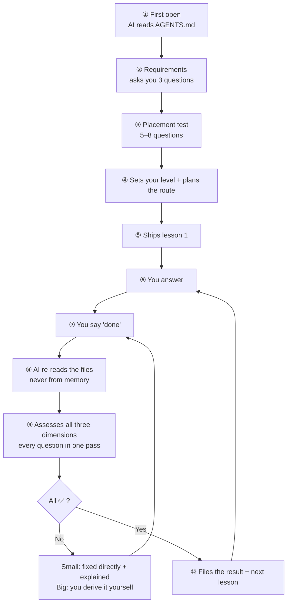

# StepsToGreat

[](https://github.com/wildcat430524/StepsToGreat/actions/workflows/check.yml)
[](./LICENSE)
[](./LICENSE-DOCS)
[](./CONTRIBUTING.md)

**Open this folder and you get a one-on-one tutor.**

A Markdown protocol — any AI tool that opens it becomes your personal teacher:
it runs a placement test, teaches lessons, grades your work, explains *what you got wrong and why*,
then records your progress so you can pick up where you left off.

**Nothing to install for the learner.** No Node, no npm, no API key, no account.

[简体中文](./README.md) | English

---

## Why this exists

AI is already good enough to teach. **What was always missing isn't content — it's someone watching you.**

| Your current situation | How StepsToGreat fixes it |
|---|---|
| You ask an AI "how do I learn Python?" — it hands you a roadmap, and then… nothing | The AI runs a placement test → finds your real level → plans the route → **ships lesson 1** |
| You finish a lesson; nobody checks whether you actually got it | Three-dimension assessment: **all ✅ before you may advance** |
| You get something wrong; the AI says "not quite" — and you still don't know where | Small mistakes are **fixed for you**, with the full "what you wrote → what's wrong and why → what I changed it to" |
| Close the chat and it forgets everything | State is written to files: **switch tools, come back a month later, keep going** |
| Switch AI tools and lose all your history | Your data is plain Markdown — **portable across any tool** |

### Versus just asking an AI

| | Just asking an AI | StepsToGreat |
|---|---|---|
| Persona | You re-explain "you're my teacher" every time | ✅ Baked into `AGENTS.md` — zero cost |
| Remembers your progress | ❌ Context only; gone when closed | ✅ Written to `我的学习/00-学习档案.md` |
| Makes you practise | ❌ Only answers when asked | ✅ Sets questions → waits for "done" → assesses |
| Points out your mistakes | ⚠️ Usually just gives the right answer | ✅ Three-part explanation, separating slips from real gaps |
| Switching tools | ❌ History lost | ✅ Works anywhere |
| Who owns the data | The platform | ✅ Your own folder |

---

## Who it's for — and who it's not for

**Said up front, so you don't waste a download.**

| ✅ Good fit | ❌ Not a fit |
|---|---|
| Self-studying a skill, but always quitting halfway | Wanting ready-made course videos / textbooks — **this project ships no content** |
| Wanting someone to watch you and check your work | Wanting a "ask one question, get one answer" assistant |
| A concrete goal (an exam / a project / a weak spot) | No goal at all, just browsing |
| Willing to **write answers** (typing or on paper) | Wanting to listen passively without doing exercises |
| Studying long-term (weeks to years) | Looking up a single fact once |
| You have your own material (textbooks / past papers / notes) | Expecting the AI to invent a curriculum from memory |

> **In one line**: if what you want is *someone who sets questions, grades them, and makes you practise* — this fits.
> If what you want is *content*, go find a course. This project handles **the person watching you**.

---

## How it works



**You only ever say two things**: the opening line, and "**done**".

---

## Core mechanics

### 1. Three dimensions — all ✅ to advance

Every topic is assessed on three **independent** dimensions — the soul of the project:

| Dimension | Programming | English | Math | Humanities |
|---|---|---|---|---|
| ① **Concept** | Do you get it | Did you understand | Are the concepts clear | Did you grasp it |
| ② **Logic** | Algorithm / edge cases | Does it express the meaning | Derivation / calculation | Does the argument hold |
| ③ **Form** | Does it compile | Grammar | Notation | Presentation |

> **All three ✅ = mastered, and only then may you advance.** Any ⚠️ means keep practising.

**Why three independent ones?** Concept alone → can talk but can't do. Logic alone → right answer, can't explain.
Form alone → pretty but wrong. Collapse them into one "overall score" and you can no longer tell
"understood but slipped" from "didn't understand at all" — and those need completely different responses.

### 2. Small mistakes get fixed for you; big ones you derive yourself

Typos, single-point syntax, missing symbols — **small problems**, and the AI **fixes them directly**
so you don't burn a round-trip. **Big problems** (wrong concept, broken logic) stay Socratic — you derive
the fix, because that *is* the learning.

Here's what it actually looks like (real format):

```
You: done.

AI:  I re-read your answers (5 questions). Assessment:

| # | Concept | Logic   | Form    | Verdict   |
|---|---------|---------|---------|-----------|
| 1 | ✅      | — N/A   | — N/A   | pass      |
| 2 | ✅      | ✅      | — N/A   | pass      |
| 3 | ✅      | ✅      | ✅      | pass      |
| 4 | ✅      | ✅      | ✅      | pass      |
| 5 | ✅      | ⚠️      | ✅      | needs work|

## 1️⃣ Problem 5: wrong loop range

**What you wrote**
for i in range(5):
    print(i)

**What's wrong**
- range(5) yields 0,1,2,3,4 — starts at 0, stops before 5
- The task wants 1 to 5, so you lose the 5 and gain a 0
- This is Python's "inclusive start, exclusive end" convention — the classic beginner trap

**What I changed it to**
for i in range(1, 6):
    print(i)

The other 4 were fine — you got them right. Tell me when you've fixed it.
```

> Note that last line: "**the other 4 were fine**". The protocol requires saying so explicitly —
> otherwise the student assumes silence means something is wrong.

### 3. State lives in exactly three places

| Location | Answers |
|---|---|
| 🚦 Handoff Status | What lesson are we on now |
| 📊 Mastery Table | What counts as truly mastered |
| ⏳ To-do Table | What's pending |

So you can **close it and come back any time** and pick up where you left off.

---

## Five-minute setup

### The learner installs nothing

| | |
|---|---|
| ❌ No Node.js / npm | The protocol is plain Markdown — no build step |
| ❌ No Git | Downloading a ZIP works just as well |
| ❌ No API key | The recommended tools ship with a free tier |
| ❌ No sign-up for this project | No server, no account, no subscription |
| ✅ All you need | One AI tool that can open a folder |

### Five steps

- [ ] **1. Install an AI tool** — recommended: [Trae](https://www.trae.cn): free, Chinese UI, graphical, no API key

  Open the site → download for Windows → install → log in with phone / WeChat

  Alternatives: **ZCode** (Z.ai — reads `AGENTS.md` natively, zero config), **CodeBuddy** (Tencent), **Qoder** (Alibaba), **Cursor**

- [ ] **2. Open the folder** — `File → Open Folder` → select `StepsToGreat`

  > ⚠️ Open the **folder itself**, not a file inside it. Get this wrong and the AI can't read the rules — everything downstream fails.

- [ ] **3. Trae users: flip one switch** — `Settings (gear) → Rules → Import settings → turn on "Include AGENTS.md in context"`

  > **90% of people miss this.** Most other tools need no configuration.

- [ ] **4. Say the first sentence**

  ```
  I'm the student. Please read AGENTS.md first, then begin.
  ```

- [ ] **5. Verify it worked** — ask it:

  ```
  Recite the "Hard rules" section of AGENTS.md — how many are there?
  ```

  The correct answer is **9**. Can't answer → go back to steps 2 and 3.

📖 Full tutorial: [`教程/01-five-minute-setup.en.md`](./教程/01-five-minute-setup.en.md)
🖼 UI mockups (plain text, no screenshots): [`教程/ui-mockups.en.md`](./教程/ui-mockups.en.md)
🔍 Stuck? [§9 troubleshooting decision tree](./教程/ui-mockups.en.md#9-when-something-breaks-start-with-this-diagram)

---

## What you can learn

| Type | Examples |
|---|---|
| Programming | Python, Java, frontend, algorithms, SQL |
| Languages | English, Japanese, IELTS/TOEFL |
| Humanities | History, politics, philosophy, law |
| Sciences | Math, physics, chemistry, biology |
| Exam prep | Grad school entrance, civil service, certifications |
| **Anything else** | The AI generates a subject pack on the spot (music, fitness, writing…) |

Five subject packs are built in ([programming](./学科包/编程.en.md) / [language](./学科包/语言.en.md) / [humanities](./学科包/文科.en.md) / [science](./学科包/理科.en.md) / [exam prep](./学科包/考试.en.md)).

**No match?** The AI generates one from [`_自定义学科包模板.md`](./学科包/_自定义学科包模板.md) —
the crux is two questions: **in this subject, what is a "structural error" (must lose points), and what is a "slip" (no penalty)?**

Answer those two and *any* skill becomes assessable — guitar, fitness, drawing, writing, software operation.

---

## Supported AI tools

**25+ tools**, via "one contract + auto-generated pointers":

```
your tool → the file it reads (CLAUDE.md / CODEBUDDY.md / .trae/rules / GEMINI.md …)
        → all point to → AGENTS.md (single source of truth)
```

Change a rule in exactly one place (`AGENTS.md`); the other 25 pointer files are script-generated — **they can never drift**.

| Works out of the box | Needs one switch | Pointer provided |
|---|---|---|
| Codex · Cursor · Qoder · ZCode · Cline · Roo · Kilo · Zed · goose · Warp · Windsurf · Kiro · Augment · Junie · Amazon Q | **Trae** (in settings) | Claude Code · CodeBuddy · WorkBuddy · Gemini CLI · Continue · Antigravity · Qwen Code · Aider |

📋 Full matrix (with each tool's exact behaviour): [`docs/AGENT-COMPAT.md`](./docs/AGENT-COMPAT.md)

---

## Layout

```
StepsToGreat/
├── AGENTS.md                    ← the single contract (AI starts here)
├── AGENTS.en.md                 ← English version
├── CONTEXT.md                   ← glossary (keeps terms from blurring)
├── 协议/                         ← teaching rules: 3-dimension assessment / direct-fix / placement / filing
├── 学科包/                       ← per-subject assessment criteria
├── 模板/                         ← blank templates
├── 示例/                         ← 5-minute demo of the whole loop
├── 教程/                         ← setup / per-tool guides / UI mockups / design notes
├── _tools/                       ← pointer generator + content checks
├── docs/                         ← compatibility matrix + 6 ADRs
├── 我的学习/                     ← [YOUR DATA] everything is recorded here
└── 资料/                         ← [YOUR MATERIAL] the AI reads this
```

**Framework and data are separated**: `我的学习/` and `资料/` are git-ignored —
updating the framework (`git pull`) will **never** overwrite your learning records.

---

## FAQ

**Will switching AI tools lose my records?**
No. Everything is plain Markdown under `我的学习/`. Switch tools → open the same folder → say "continue".

**Does it cost money?**
The protocol is free. Most AI tools have free tiers (Trae CN: 500 credits/month). The protocol is plain Markdown — no server, no account, no subscription.

**Do I need to be technical?**
No. Opening a folder and typing is enough. **The learner installs no Node / npm / Git.**

**Will my material be uploaded?**
Some tools do (Trae temporarily uploads for indexing; CodeBuddy's personal edition goes through Tencent Cloud).
**For sensitive material, use a tool that supports local models** (Zed / goose + Ollama).

**What if the AI grades me wrong?**
Say so, with your reasoning. The protocol **explicitly lets you challenge it** — if you disagree with the placement result, you win.

**Can I study several subjects at once?**
Yes. One directory per subject under `我的学习/学科/<subject>/`, with `00-学习档案.md` covering the whole.

**Can I use it offline?**
The protocol itself is fully offline. The *tutor* is an AI, so it needs a model — run a local one (Ollama) and nothing ever leaves your machine.

**How do I contribute a subject pack?**
Copy [`学科包/_自定义学科包模板.md`](./学科包/_自定义学科包模板.md), fill in 6 parts, open a PR. **Most needed: music, fitness, drawing, writing, software operation.**

---

## Contributing

| Type | How |
|---|---|
| ⭐ **Add a subject pack** (most valuable) | Copy `学科包/_自定义学科包模板.md` → fill 6 parts → PR |
| Add an AI tool | Edit `TARGETS` in `_tools/setup-agents.mjs` → run the script → PR |
| Change the protocol | **Open an issue first** describing the problem you hit (the protocol is the core asset; changes propagate to every user) |

```bash
npm run verify    # one command: pointer consistency + content checks + mermaid rendering
```

Checks cover: fence pairing · broken links · **cross-document anchor validity** · leftover placeholders · UTF-8 without BOM · LF endings · **no local images** · pointer consistency.
(Tutorial illustrations are always plain text + mermaid, never screenshots — see [ADR-0006](./docs/adr/0006-text-diagrams-not-screenshots.md))

See [`CONTRIBUTING.md`](./CONTRIBUTING.md) ｜ design rationale [`教程/03-design-notes.en.md`](./教程/03-design-notes.en.md) ｜ decisions [`docs/adr/`](./docs/adr/)

---

## License

| Part | License |
|---|---|
| **Code** (`_tools/`) | [MIT](./LICENSE) |
| **Docs** (protocol, subject packs, tutorials, templates) | [CC BY 4.0](./LICENSE-DOCS) |

Please keep attribution when republishing teaching material.

---

**Start now** → open your AI tool and say:

```
I'm the student. Please read AGENTS.md first, then begin.
```
