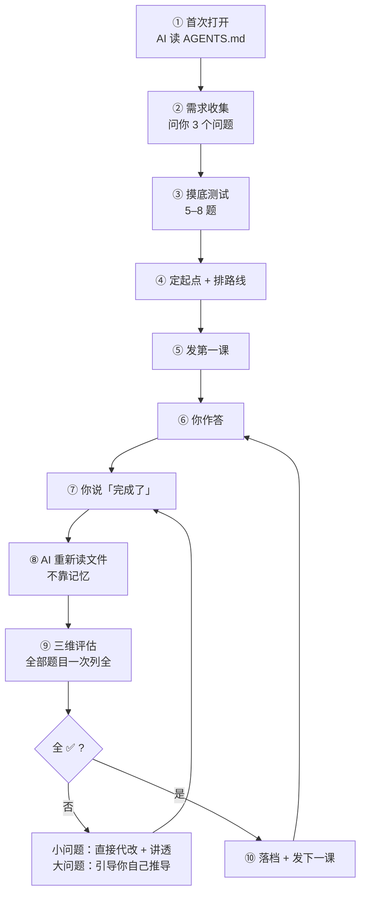

# StepsToGreat

[](https://github.com/wildcat430524/StepsToGreat/actions/workflows/check.yml)
[](./LICENSE)
[](./LICENSE-DOCS)
[](./CONTRIBUTING.md)

**打开这个文件夹，就有一位一对一导师。**

一个 Markdown 协议 —— 任何 AI 工具打开它，都会变成你的私人老师：
先摸底、再上课、批作业、把「你哪里错了、为什么错」讲透，然后记下进度，等你下次回来。

**使用者不需要安装任何东西。** 没有 Node、没有 npm、没有 API Key、没有账号。

[English](./README.en.md) | 简体中文

---

## 为什么需要这个

AI 已经足够会教。**缺的从来不是内容，是那个盯着你的人。**

| 你现在的处境 | StepsToGreat 怎么解决 |
|---|---|
| 问 AI「我该怎么学 Python」，它给你一份路线图，然后就没有然后了 | AI 出摸底测试 → 定你的真实起点 → 排路线 → **发第一课** |
| 学完一课，没人检查你到底会不会 | 三维评估，**全 ✅ 才允许推进下一课** |
| 做错了，AI 说「不完全正确哦」——你还是不知道自己错在哪 | 小问题**直接帮你改**，并讲透「你写的 → 错在哪为什么 → 我改成什么」 |
| 关了对话就失忆，下次得从头解释 | 状态落盘在文件里，**换个工具、隔一个月回来都能接上** |
| 换了 AI 工具，之前的记录全废 | 数据是普通 Markdown，**换任何工具都不丢** |

### 和「直接问 AI」的区别

| | 直接问 AI | StepsToGreat |
|---|---|---|
| 有人格设定 | 每次要重新解释「你是我的老师」 | ✅ 写死在 `AGENTS.md`，零成本 |
| 记得你学到哪 | ❌ 靠上下文，关了就忘 | ✅ 落盘在 `我的学习/00-学习档案.md` |
| 会逼你练 | ❌ 你问它才答 | ✅ 出题 → 等你说「完成了」→ 评估 |
| 会挑你错 | ⚠️ 通常只给正确答案 | ✅ 三段式讲透，区分「手滑」和「真不会」 |
| 换工具 | ❌ 记录全丢 | ✅ 换工具照用 |
| 数据归属 | 平台 | ✅ 你自己的文件夹 |

---

## 适合谁，不适合谁

**先说清楚，免得你白装一次。**

| ✅ 适合 | ❌ 不适合 |
|---|---|
| 自学一门技能，但总半途而废 | 想要现成的课程视频 / 教材 —— **本项目不提供内容** |
| 需要一个盯着你、检查你的角色 | 只想要「问一句答一句」的助手 |
| 目标明确（考试 / 项目 / 补短板） | 完全没目标，只想随便看看 |
| 愿意**动手写答案**（打字或纸笔） | 只想被动听讲，不愿做题 |
| 想长期学（几周到几年） | 只想临时查一个知识点 |
| 手里有自己的资料（教材 / 真题 / 笔记） | 期待 AI 凭记忆编课程 |

> **一句话**：如果你要的是「有人出题、批改、逼你练」，这个项目对口。
> 如果你要的是「内容」，请去找课程 —— 本项目负责的是**那个盯你的人**。

---

## 它是怎么工作的



**全程你只需要说两句话**：开始时的第一句，和每次的「**完成了**」。

### 每课产出两个文档

**这是教学模式的载体** —— 每一课都在文件夹里生成两个 Markdown：

```
我的学习/学科/Python/03-for循环/
├── 01_教学引导.md    ← 导师写：讲解 + 例题 + 题目（按轮次排布）
└── 01_学生回答.md    ← 你写：在题目下的空位作答；末尾留两个占位区给导师填
```

| 文档 | 谁写 | 里面有什么 |
|---|---|---|
| **`01_教学引导.md`** | 导师 | 为什么要学 → 核心概念 → 示例 → 新旧对比 → 常见陷阱 → 和之前知识的关联 → 本节重点 → 题目（按轮次） |
| **`01_学生回答.md`** | **你** | 本轮的题目 + 你的作答；**末尾两个占位区**：`## 最终复评结果`（逐题三维表）、`## 正确答案与解析`（三段式） |

**两个关键约定**：

| 约定 | 说明 |
|---|---|
| **回答文档 = 唯一学习证据** | 是否掌握，**只以它的「最终复评结果」为准** —— 不看你聊了什么，不看 AI 说了什么 |
| **按轮次追加，不是一次列全** | 回答文档初始**只有第一轮题目**（1–3 题）；本轮全 ✅ 后，导师再**追加**下一轮 —— 否则你一眼看到全部题目，等于一次全发 |

> 💡 **为什么是「两个文档」而不是「一个对话」**：
> 对话关掉就没了，文档能留下来。三个月后你想复习「当初 for 循环我错在哪」，
> 打开 `01_学生回答.md` 就能看到原答案、错因、改法 —— **而不是去翻聊天记录**。

---

## 核心机制

### 一、三维评估，全 ✅ 才推进

每个知识点按三个**独立**维度评估 —— 这是本项目的灵魂：

| 维度 | 编程 | 英语 | 数学 | 文科 |
|---|---|---|---|---|
| ① **概念理解** | 懂不懂 | 读懂没有 | 概念清不清 | 理解到位吗 |
| ② **逻辑正确** | 算法/边界 | 表达达意吗 | 推导/计算 | 论证成立吗 |
| ③ **规范表达** | 语法可编译 | 语法规范 | 推导规范 | 表述规范 |

> **三项全 ✅ = 掌握，才允许推进下一课。** 任意一项 ⚠️ 就继续练。

**为什么必须三个独立？** 只有概念 → 能说不会做；只有逻辑 → 做对了说不清；只有规范 → 写得漂亮但理解错。
合并成一个「综合分」就分不清「懂了但手滑」和「根本没懂」—— 而这两种需要完全不同的处理。

### 二、小问题直接代改，大问题引导你自己想

笔误、单点语法、缺符号这类**小问题**，AI **直接帮你改**，不让你白答一轮。
**大问题**（概念错、逻辑不通）仍走苏格拉底式引导，让你自己推导 —— 那才是学习本身。

实际长这样（真实格式）：

```
你：完成了。

AI：我重新读了你的答案（本轮 2 题），逐题评估：

| 题号 | 概念理解 | 逻辑正确 | 规范表达 | 结论     |
|------|----------|----------|----------|----------|
| 1    | ✅       | — 不适用 | — 不适用 | 通过     |
| 2    | ✅       | ⚠️       | ✅       | 需要修改 |

## 1️⃣ 问题 2：循环范围错了

**你的原答案**
for i in range(5):
    print(i)

**问题在哪里**
- range(5) 产生 0,1,2,3,4 —— 从 0 开始，到 4 结束（不含 5）
- 题目要求打印 1 到 5，所以会少一个 5、多一个 0
- 这是 Python「左闭右开」的约定，初学者最容易踩

**我改成**
for i in range(1, 6):
    print(i)

问题 1 没问题，你答得对。改好告诉我，我们再进第二轮。
```

> 注意两处细节：
> ① 「**问题 1 没问题，你答得对**」—— 协议规定没改的题也要明确说通过，否则学生会以为「没说 = 有问题」。
> ② 「**我们再进第二轮**」—— 一轮只有 1–3 题，本轮全 ✅ 才发下一轮。

### 三、状态只写在三个地方

| 位置 | 回答什么 |
|---|---|
| 🚦 当前交接状态 | 现在这一课是什么 |
| 📊 掌握表 | 哪些算真掌握 |
| ⏳ 待办表 | 有什么挂起 |

所以你**随时关掉、随时回来**都能接上。

### 三、费曼学习法：讲不清 = 没真懂

**最危险的不是「不会」，是「你以为你会」。**

普通的题可以靠套公式、背模板、凭熟悉度蒙对 —— **答对不等于真懂**。
所以导师会**偶尔**让你用**外行能听懂的话**把一个概念讲一遍：

```
AI：不许用这些词：<闭包>、<作用域>、<引用>

    用你妈能听懂的话解释：为什么这个函数「记住」了外面的变量？
    3–5 句话说清即可。

你：（讲……）

AI：你用「随身背包」这个类比很好 —— 背包里装的就是它记住的变量。
    但你说「背包会自己更新」这里卡住了，那正是关键。
    重讲这一段就行，不用全篇重来。
```

**为什么它比普通题更有价值**：

| 普通题 | 费曼题 |
|---|---|
| 可以套公式、背模板、靠熟悉度蒙对 | 必须自己组织语言，套不了 |
| 答对 ≠ 真懂 | **讲不清 = 一定没懂**（几乎不会误判） |
| 测「能不能做」 | 测「**是不是真理解**」 |

**频率是自适应的，不会频繁问你**：

| 更该问 | 可以少问 |
|---|---|
| 抽象概念、原理、易混概念 | 纯操作、记忆性内容 |
| 你刚接触这个领域 / 此前讲得不好 | 你已经能熟练应用 / 此前讲得好 |
| **大模块收尾**（如「OOP 学完了」） | 模块中途、推进顺利时 |

**硬性约束**（写进协议，防止滥用）：

- ✅ 大模块收尾**必做 1 次**；一个知识点**最多问 2 次**
- ❌ **不许每课都问**；不许连续两轮都出费曼题
- ✅ 学生说「我不想讲，直接考我」→ **尊重他**，改用普通题
- ✅ 费曼题**只评概念理解**，该轮**只出这一题**（它比普通题耗时）

> 各学科的用法不同，`学科包/` 里有专门一节：
> 编程**禁止写代码**、理科**禁止写公式**、文科**必须举具体例子**、应试场景**要克制使用**。

---

## 一个完整的对话案例

> ⚠️ **说明**：下面是一次完整学习过程的**场景还原**（按本项目的协议逐条推演，内容真实可信，
> 但**不是**逐字录音 —— 本项目不收集任何用户对话）。
> 它演示的是「协议跑起来之后，对话会长什么样」。
>
> 场景：Python 零基础学生，目标「写脚本处理 Excel」，从第一次打开文件夹到第三课通过，中间跨了一周。

### 第 1 天 · 第一次打开

**你**：
```
我是学生，请先读 AGENTS.md，然后开始。
```

**AI**：
```
我读了 AGENTS.md 和协议。你的学习档案还是空的，所以先做需求收集。

三个问题（一次答完就行）：
1. 你为什么学 Python？→ 想自动处理 Excel，工作要用
2. 以前接触过吗？→ 完全没碰过
3. 学完想做到什么？→ 能自己写脚本批量改 Excel

答完我做摸底测试（5–8 题，但会分几轮问，不会一次砸给你）。
```

**你**：
```
1 工作要用 2 没学过 3 能批量改excel
```

**AI**：
```
记下了。摸底第一轮，2 题：

**问题 1**：`print("hi")` 和 `x = 1` 有什么不同？

**问题 2**：写一行代码，把 `3` 和 `5` 加起来并打印出来。

（提示：第 2 题不记得语法没关系，写你知道的部分就行）
```

> 💡 **注意**：摸底也遵守「每轮 1–3 题」——不会一上来甩 8 道题。

### 摸底结论（略去中间过程）

**AI**：
```
✅ 摸底结论：起点是 L1 零基础。

   - 已具备：会用 Excel、知道什么是单元格
   - 需要补：变量、循环、文件读写
   - 建议从：第 1 课「变量与数据类型」开始
   - 预计 8 课能到「写出批量改 Excel 的脚本」

已写入 我的学习/学科/Python/00-摸底测试.md，并排好了前 5 课。
要开始第 1 课吗？
```

### 第 3 课 · 一次典型的一轮

**AI**（发课）：
```
**下一步：#3 for 循环与 range()**（你后面批量处理 Excel 每一行，全靠它）

### 📁 文档位置
- 教学引导：我的学习/学科/Python/03-for循环/01_教学引导.md
- 回答文档：我的学习/学科/Python/03-for循环/01_学生回答.md

### 📖 本课重点
1. for 循环在遍历什么
2. range() 的左闭右开
3. 循环里怎么用变量
4. 什么时候不该用 for
5. 常见死循环陷阱

### ✅ 你的任务
读教学引导，完成回答文档里的**第一轮 2 题**，然后说「完成了」。
```

**你**（在 `01_学生回答.md` 里作答）：
```python
# 第一轮 · 问题 1：range(3) 会打印出哪些数字？为什么？
# 答：会打印 0 1 2，因为 range 从 0 开始

# 第一轮 · 问题 2：写代码打印 1 到 5
for i in range(5):
    print(i)
```

**你**：
```
完成了
```

**AI**：
```
我重新读了你的回答文档（本轮 2 题）：

| 题号 | 概念理解 | 逻辑正确 | 规范表达 | 结论     |
|------|----------|----------|----------|----------|
| 1    | ✅       | — 不适用 | — 不适用 | 通过     |
| 2    | ✅       | ❌       | ✅       | 需要修改 |

---

## 1️⃣ 问题 2：循环范围错了

**你的原答案**
for i in range(5):
    print(i)

**问题在哪里**
- range(5) 产生 0,1,2,3,4 —— 从 0 开始，到 4 结束（**不含 5**）
- 题目要打印 1 到 5，你的输出是 0 到 4：**少一个 5，多一个 0**
- 这是 Python「左闭右开」的约定，也是初学者最容易踩的坑

**我改成**
for i in range(1, 6):
    print(i)

---

问题 1 你答得对，「range 从 0 开始」这个理解很关键。

改好问题 2 告诉我，我们进第二轮。
```

> 💡 这里体现了三条协议：
> **① 一次性列全本轮全部题目**（不挤牙膏）｜**② 小问题直接代改**（不让白答一轮）｜**③ 三段式讲透**（原答案 → 为什么错 → 改成什么）

### 大问题走引导（不是代改）

第二轮的题要求「打印 1 到 10 里的偶数」。你写的是：

```python
for i in range(1, 11):
    print(i)
```

**AI**：
```
## 1️⃣ 问题 3：偶数判断漏了

这个和上一题不一样 —— 上一题是**写法**问题（我直接帮你改了），
这一题是**逻辑**问题，得你自己想明白。

你的代码会打印 1 到 10 全部数字，但题目只要**偶数**。

先别急着写代码，回答我一个问题：

> **如果让你用嘴说出「一个数是偶数」的判断标准，你会怎么说？**

（想不出来再看提示：Python 里用什么符号能求余数？）
```

**你**：
```
除以2余数是0
```

**AI**：
```
对，就是这个。那把它写成代码是什么样？

（提示：`%` 求余数，`==` 判断相等，`if` 做选择 —— 三个都用上）
```

**你**：
```python
for i in range(1, 11):
    if i % 2 == 0:
        print(i)
```

**AI**：
```
✅ 对了。你自己推出来的，这个印象会比别人告诉你深得多。

本轮 2 题现在都通过了。
```

> 💡 **这就是「小问题代改 / 大问题引导」的分界**：
> 写法错 → 直接改（省你一轮）；逻辑错 → 必须你自己想（那才是学习）。

### 落档 + 发下一课

**AI**：
```
#3 for 循环与 range() 已闭环 ✅
**复评结果**：概念、逻辑、规范全部通过。
本轮 2 处问题：1 处我直接代改，1 处你自推导修正。

已更新：
- 01_学生回答.md → 最终复评结果 + 正确答案与解析
- 00-学习档案.md → 📊 掌握表新增「for 循环与 range()」+ 🚦 交接状态

---

**下一步：#4 while 循环与 break**（有些场景 for 写不了，比如「一直读直到文件结束」）

### 📖 本课重点
1. while 和 for 的本质区别
2. 什么时候必须用 while
3. break / continue 怎么用
4. 死循环怎么避免
5. 循环嵌套

### 📚 本课资料
- 必读：《Python 编程从入门到实践》§7.1–7.3（课前读）
- 本课自测来源：§7 课后题 7-1 ~ 7-3

### ✅ 你的任务
完成第一轮 2 题，然后说「完成了」。

> ⏳ 复习提醒（不阻塞）：你已经掌握 3 个知识点，下一课之前我会先问 1 道综合题。
```

### 第 7 天 · 一次费曼题（循环模块学完了）

> 「循环」这个小模块学完了（for / while / break / 嵌套）。按协议，
> **大模块收尾必做一次费曼** —— 而且这一轮**只出这 1 题**。

**AI**：
```
循环这个模块学完了。这轮只有 1 道题，但不是普通题 —— 是一道**费曼题**。

不许用这些词：<循环>、<遍历>、<迭代>、<range>

**用你妈能听懂的话解释：为什么电脑需要「重复做一件事」这个功能？**

3–5 句话说清即可。可以打比方，举生活里的例子。

> 这不是考试。讲不清很正常 —— 讲不清恰恰说明这里有洞，正好补。
```

**你**：
```
就像洗衣服，你不会一件一件手洗，而是把一堆衣服丢进洗衣机，
设定好程序，它自己转。电脑也一样，你不用写一百遍同样的代码，
只要告诉它「对这一堆东西，每个都做同样的动作」就行。
```

**AI**：
```
✅ 讲清了。而且讲得比我预期的好。

**好在哪**：你用「洗衣机」这个类比非常准 —— 它同时抓住了两件事：
① 你不用重复劳动（省掉写一百遍代码）
② 你得先「设定程序」（这就是循环体里写什么）

**一个可以更准的地方**：你说「它自己转」—— 但电脑比洗衣机死板，
它**完全不会自己判断该转几圈**，圈数必须你事先说死。这一点正好是你下一课（while）要解决的。

已记进档案：`for 循环与 range()` 备注 = ✅ 且能费曼讲清
```

> 💡 注意这次反馈的三个动作：
> **① 明确指出讲得好在哪**（洗衣机类比同时抓住了两件事）—— 不是敷衍的「讲得不错」
> **② 指出一个可以更准的地方**，并**顺势连到下一课**（while 要解决的正是「圈数不固定」）
> **③ 把费曼证据记进档案** —— 这是比「做对题」更强的掌握证明

### 第 10 天 · 关掉一周后回来

**你**（新会话，换了另一个 AI 工具）：
```
继续
```

**AI**：
```
我读了 我的学习/00-学习档案.md 的 🚦 交接状态：

- 你在学 **Python**（目标：写脚本批量处理 Excel）
- 当前课次：**#4 while 循环与 break**
- 进度：教学已发布，回答文档为空，等待你作答
- 挂起：⏳ 间隔复习 #1（3 个知识点已达触发条件）
- 接手第一步：先做间隔复习，再进 #4

要不要现在做那道复习题？（1 题，覆盖变量 / 数据类型 / for 循环）
```

> 💡 **这就是「状态落盘」的价值**：换了工具、隔了一周，AI 依然知道你在哪。
> 因为状态在**文件里**，不在对话里。

---

### 这个案例演示了什么

| 机制 | 出现位置 |
|---|---|
| 需求收集 → 摸底 → 定起点 | 第 1 天 |
| **每轮只出 1–3 题** | 摸底与每一课 |
| 三维评估（本轮全部题目一次列全） | 第 3 课 |
| **小问题代改 + 三段式** | 问题 2（写法错） |
| **大问题走引导，让你自己推** | 问题 3（逻辑错） |
| **费曼题（大模块收尾，只出 1 题）** | 第 7 天 |
| 明确说「没改的题也没问题」 | 「问题 1 你答得对」 |
| 每课产出两个文档（教学 + 答题） | 每一课 |
| 落档（回答文档 + 档案三处） | 每课通过后 |
| **换工具 / 隔一周能接上** | 第 10 天 |

> 想验证这些机制是否真的写进了协议？看
> [`协议/00_导师协议.md`](./协议/00_导师协议.md)（三维评估、代改协议、每轮 1–3 题）
> 与 [`AGENTS.md`](./AGENTS.md)（硬规则 11 条）。**对话是协议的结果，不是摆设。**

---

## 5 分钟上手

### 使用者不需要装任何东西

| | |
|---|---|
| ❌ 不需要 Node.js / npm | 协议是纯 Markdown，没有构建步骤 |
| ❌ 不需要 Git | 下载 ZIP 解压一样用 |
| ❌ 不需要 API Key | 推荐的工具自带免费额度 |
| ❌ 不需要注册本项目 | 没有服务器、没有账号、没有订阅 |
| ✅ 只需要 | 一个能打开文件夹的 AI 工具 |

### 五步走

- [ ] **1. 装一个 AI 工具** —— 推荐 [Trae](https://www.trae.cn)：免费、中文、图形界面、无需 API Key

  打开官网 → 下载 Windows 版 → 双击安装 → 手机号/微信登录

  其它可选：**ZCode**（智谱，原生认 `AGENTS.md`，零配置）、**CodeBuddy**（腾讯）、**Qoder**（阿里）、**Cursor**

- [ ] **2. 打开文件夹** —— `文件 → 打开文件夹` → 选中 `StepsToGreat`

  > ⚠️ 打开的是**文件夹本身**，不是里面的某个文件。选错这一步，AI 读不到规则，后面全部无效。

- [ ] **3. Trae 用户：开一个开关** —— `设置（齿轮）→ 规则 → 导入设置 → 打开「将 AGENTS.md 包含在上下文中」`

  > 这一步 **90% 的人会漏**。其它工具大多零配置。

- [ ] **4. 说第一句话**

  ```
  我是学生，请先读 AGENTS.md，然后开始。
  ```

- [ ] **5. 验证它读到了** —— 问它：

  ```
  请复述 AGENTS.md 里「硬规则」那部分，有几条？
  ```

  正确回答是 **9 条**。答不出 → 回第 2、3 步检查。

📖 详细教程：[`教程/01-五分钟上手.md`](./教程/01-五分钟上手.md)
🖼 界面示意（纯文本，无截图）：[`教程/界面示意图.md`](./教程/界面示意图.md)
🔍 卡住了？[`教程/界面示意图.md` §9 排查决策树](./教程/界面示意图.md#9-遇到问题先看这张图)

---

## 能学什么

| 类型 | 例子 |
|---|---|
| 编程 | Python、Java、前端、算法、SQL |
| 语言 | 英语、日语、雅思托福 |
| 文科 | 历史、政治、哲学、法学 |
| 理科 | 数学、物理、化学、生物 |
| 考试 | 考研、考公、考证 |
| **其它** | 由 AI 现场生成学科包（乐器、健身、写作…） |

内置 5 个学科包（[编程](./学科包/编程.md) / [语言](./学科包/语言.md) / [文科](./学科包/文科.md) / [理科](./学科包/理科.md) / [考试](./学科包/考试.md)）。

**没有对口的？** AI 会照 [`_自定义学科包模板.md`](./学科包/_自定义学科包模板.md) 现场生成一个 ——
关键就两问：**这个学科里，什么是「结构性错误」（必须扣分），什么是「手滑」（不扣分）？**

答得出这两问，任何技能都能被评估 —— 吉他、健身、绘画、写作、软件操作都行。

---

## 学习规则（可以改成你自己的）

框架自带一套默认教学规则，但**规则不是写死的** —— 你可以全部改掉。

**怎么改？** 三种方式，任选：

| 方式 | 怎么做 |
|---|---|
| **直接改** | 编辑 [`我的学习/我的规则.md`](./我的学习/我的规则.md) |
| **口头说** | 对导师说「以后每轮只出 1 题」→ 它帮你写进去 |
| **不改** | 全用默认规则，也没问题 |

### 可以改什么

| 可改的 | 默认值 | 例子 |
|---|---|---|
| **每轮出几题** | 1–3 题 | 「每轮只出 1 题，我节奏慢」 |
| **一课总题量** | 约 5 题 | 「一课 3 题就够了」 |
| **纠错风格** | 先讲原理再给答案 | 「直接给我正确答案，别绕」 |
| **代改范围** | 笔误/语法直接改，概念错引导 | 「所有错都直接帮我改」 |
| **教学语言** | 跟学生走 | 「一律用中文」 |
| **语气 / emoji** | 耐心、克制 | 「别用 emoji」 |
| **个人偏好** | 无 | 「我讨厌长篇大论，控制在 200 字内」 |
| **目标与时间约束** | 无 | 「每天最多 30 分钟」 |

### 为什么规则能改，但框架文件不能改

| 文件 | 你能改吗 | 为什么 |
|---|---|---|
| [`我的学习/我的规则.md`](./我的学习/我的规则.md) | ✅ **随便改** | 你的规则，优先级最高，`git pull` 不会覆盖 |
| `协议/` `学科包/` `模板/` `_tools/` | ❌ 只读 | 框架本体。改了会和框架更新冲突，而且**规则会漂移** |

**设计原理**：改规则的正确位置是「**覆盖层**」，不是「改源码」。
你的规则单独存一份，优先级高于框架默认 —— 这样你既完全自由，又能随时 `git pull` 拿到框架更新。

### 规则优先级

冲突时，上面的赢：

```
1. 我的学习/我的规则.md        ← 你的规则，最高
2. 你当场说的话
3. 我的学习/00-学习档案.md 🚦   ← 当前进度（状态）
4. 协议/00_导师协议.md          ← 框架默认
5. 学科包/<学科>.md             ← 学科评估口径
```

> **一个建议**：`三维全 ✅ 才推进` 这条建议保留。
> 它是本项目的核心机制 —— 改成「差不多就行」，项目就退化成一个普通聊天助手了。
> 当然，那是你的选择；但改了之后，你就知道代价是什么。

---

## 支持哪些 AI 工具

**25+ 个**，原理是「单一契约 + 自动生成跳板」：

```
你的工具 → 它认的文件（CLAUDE.md / CODEBUDDY.md / .trae/rules / GEMINI.md …）
        → 全部指向 → AGENTS.md（唯一真相）
```

改规则只改 `AGENTS.md` 一处，其余 25 个跳板文件由脚本生成 —— **永不漂移**。

| 零配置直接用 | 需要开个开关 | 需跳板（已生成） |
|---|---|---|
| Codex · Cursor · Qoder · ZCode · Cline · Roo · Kilo · Zed · goose · Warp · Windsurf · Kiro · Augment · Junie · Amazon Q | **Trae**（设置里开） | Claude Code · CodeBuddy · WorkBuddy · Gemini CLI · Continue · Antigravity · Qwen Code · Aider |

📋 完整矩阵（含每个工具的确切行为）：[`docs/AGENT-COMPAT.md`](./docs/AGENT-COMPAT.md)

---

## 目录结构

```
StepsToGreat/
├── AGENTS.md                    ← 唯一契约（AI 从这里开始）
├── AGENTS.en.md                 ← 英文版
├── CONTEXT.md                   ← 术语表（避免概念混用）
├── 协议/                         ← 教学规则：三维评估 / 代改协议 / 摸底剧本 / 落档事件表
├── 学科包/                       ← 各学科的评估口径
├── 模板/                         ← 档案 / 路线 / 摸底 / 教学 / 回答 的空模板
├── 示例/                         ← 5 分钟跑通全流程的演示
├── 教程/                         ← 上手 / 各工具接入 / 界面示意 / 设计说明
├── _tools/                       ← 跳板生成 + 内容质检脚本
├── docs/                         ← 兼容矩阵 + 9 篇架构决策记录（ADR）
├── 我的学习/                     ← 【你的数据】全部记录在这里
│   ├── 00-学习档案.md            ← 进度总状态
│   └── 我的规则.md               ← 【你的规则】优先级最高，随便改
└── 资料/                         ← 【你的资料】放这里，AI 会读
```

**框架与数据分离**：`我的学习/` 和 `资料/` 已被 `.gitignore` 忽略（保留起始档案与你的规则文件）——
更新框架（`git pull`）**永远不会**覆盖你的学习记录或你改过的规则。

---

## 常见问题

**换 AI 工具会丢记录吗？**
不会。全部数据是普通 Markdown，在 `我的学习/` 里。换工具 → 打开同一个文件夹 → 说「继续」。

**要花钱吗？**
协议本身免费。AI 工具大多有免费额度（Trae 国内版每月 500 积分）。协议文件是纯 Markdown，没有服务器、没有账号、没有订阅。

**要懂技术吗？**
不用。会「打开文件夹」和「打字」就够了。**使用者不需要装 Node / npm / Git。**

**我的资料会被上传吗？**
部分工具会（Trae 索引时临时上传、CodeBuddy 个人版过腾讯云）。
**敏感资料请用支持本地模型的工具**（Zed / goose + Ollama）。

**AI 判错了怎么办？**
直接说「我觉得这题你判错了，理由是…」。协议**明确允许学生质疑**，摸底结论不认同时以学生为准。

**能同时学好几科吗？**
能。`我的学习/学科/<学科名>/` 下每科一个目录，`00-学习档案.md` 管全局。

**能离线用吗？**
协议本身完全离线。但「导师」是 AI，需要模型 —— 可用本地模型（Ollama）做到全程不联网。

**怎么贡献一个新学科包？**
复制 [`学科包/_自定义学科包模板.md`](./学科包/_自定义学科包模板.md)，填 7 个部分。**最缺的是：乐器、健身、绘画、写作、软件操作**。

---

## 想更深入了解

| 想了解 | 看这里 |
|---|---|
| 怎么用 | [`教程/01-五分钟上手.md`](./教程/01-五分钟上手.md) |
| 每个 AI 工具怎么接 | [`教程/02-各工具接入指南.md`](./教程/02-各工具接入指南.md) |
| 界面长什么样 | [`教程/界面示意图.md`](./教程/界面示意图.md) |
| **为什么这么设计** | [`教程/03-设计说明.md`](./教程/03-设计说明.md) |
| 每个决策的取舍 | [`docs/adr/`](./docs/adr/)（9 篇） |
| 工具兼容性矩阵 | [`docs/AGENT-COMPAT.md`](./docs/AGENT-COMPAT.md) |
| 术语定义 | [`CONTEXT.md`](./CONTEXT.md) |
| 改规则 | [`我的学习/我的规则.md`](./我的学习/我的规则.md) |

---

## 许可

| 部分 | 许可 |
|---|---|
| **代码**（`_tools/`） | [MIT](./LICENSE) |
| **文档**（协议、学科包、教程、模板） | [CC BY 4.0](./LICENSE-DOCS) |

教学文档被转载时请保留署名与出处。

---

**现在开始** → 打开 AI 工具，说：

```
我是学生，请先读 AGENTS.md，然后开始。
```
