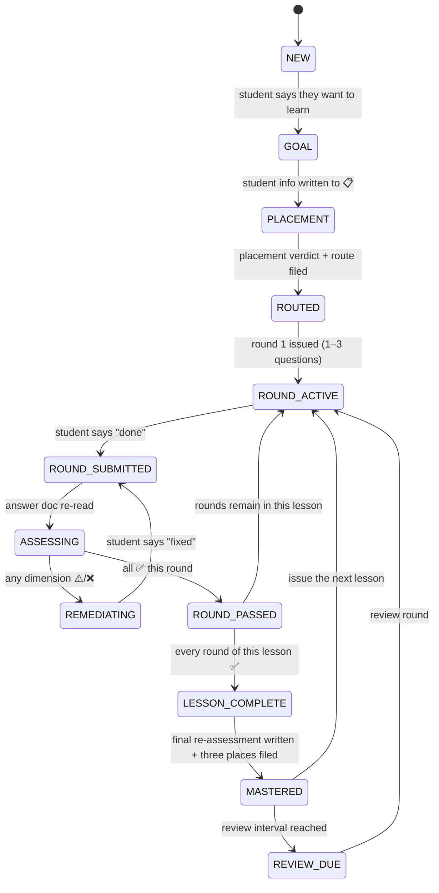

# 04_State Machine

> Purpose: turn "what should the tutor do right now" from **prose advice** into **decidable states**.
> Each state states three things: **entry condition** (how you know you're here), **allowed actions**, and **invariants** (what must hold on disk).
> Invariants are mechanically checked by [`../_tools/validate-state.mjs`](../_tools/validate-state.mjs) — violations get reported by a tool instead of relying on self-discipline.
> Chinese version: [`04_状态机.md`](./04_状态机.md)

**Current protocol version: 1** (the "Protocol version" row in 📋 Student info; upgrade flow in [`../docs/UPGRADE.md`](../docs/UPGRADE.md))

---

## 1. Why a state machine

The project's flow used to live only in scattered prose ("handover order", "main loop", "when to file").
Prose describes **sequence**, but cannot describe **what is forbidden right now** — and that is exactly where violations happen:

| A mistake that really happens | Only a state machine stops it |
|---|---|
| Publishing the next lesson before the current one passed | Requires the previous lesson to be in `MASTERED` to enter `ROUND_ACTIVE` |
| Mastery table says ✅ but the answer doc has no re-assessment verdict | Requires `MASTERED` to have on-disk evidence |
| Student says "done" and the tutor grades from memory | Requires re-reading the file before leaving `ROUND_SUBMITTED` |
| Dumping all of a lesson's questions at once | `ROUND_ACTIVE` holds at most 1–3 questions |

**Core idea: a state is not a label for yourself — it is a licence for actions.**

---

## 2. State overview



---

## 3. State definitions

| State | Entry condition (on-disk evidence) | Allowed actions | Forbidden actions |
|---|---|---|---|
| **`NEW`** | `我的学习/00-学习档案.md` exists and is still the blank template | Requirements gathering | Issuing questions or lessons |
| **`GOAL`** | 📋 Student info filled (what / why / goal / daily time) | Probing, writing 📋 | Placement (goal not confirmed yet) |
| **`PLACEMENT`** | Placement test file created | Issuing per [`01_摸底剧本.md`](./01_摸底剧本.md), grading | Publishing formal lessons |
| **`ROUTED`** | `00-摸底测试.md` has a verdict + `00-课程路线.md` lays out the first 3–5 lessons | Publishing lesson 1 | Skipping the route and starting a lesson |
| **`ROUND_ACTIVE`** | Current lesson's teaching + answer docs exist; answer doc holds **unanswered** questions | Waiting for the student | Appending the next round, issuing the next lesson |
| **`ROUND_SUBMITTED`** | Student said "done" (transient) | Re-reading the answer doc | **Grading from conversation memory** (must re-read to leave this state) |
| **`ASSESSING`** | Answer doc has been re-read (transient) | 3-dimension assessment of every question this round, all at once | Skipping questions, drip-feed corrections |
| **`REMEDIATING`** | At least one applicable dimension is not ✅ | Direct fix + three-part explanation for small issues; Socratic guidance for big ones | Advancing, publishing the next lesson |
| **`ROUND_PASSED`** | All three dimensions ✅ for this round | Filing the round, appending the next round | Jumping to `MASTERED` while rounds remain |
| **`LESSON_COMPLETE`** | Every round of this lesson ✅ | Writing "Final Re-assessment" + "Correct Answers & Analysis" | Editing the profile before the verdict exists |
| **`MASTERED`** | Answer doc has a **filled-in** final re-assessment + 📊 marked ✅ | Issuing the next lesson, updating 🚦 | Editing the student's historical answers |
| **`REVIEW_DUE`** | ⏳ To-do table holds a due review/Feynman item | Issuing review questions, re-running Feynman | Re-teaching it as a brand-new topic |

---

## 4. Invariants (what the checker actually verifies)

> These 12 are the checking criteria of `validate-state.mjs`. The IDs are used in error messages.

### Structural

| # | Invariant | Consequence of violation |
|---|---|---|
| **I1** | Profile contains five sections: 📋 Student info / 🚦 Handoff Status / 📊 Mastery table / ⏳ To-do / 📚 Lesson index | Handover reads no state |
| **I2** | A blank-template profile is treated as `NEW`; remaining checks skipped. **The criterion is structure, not a keyword**: 🚦 / 📊 / 📚 must **all** still be unfilled. Merely mentioning "尚未开始" elsewhere in the text does not count | A started profile is mistaken for a blank template → **every check is silently skipped** |
| **I12** | The profile's "Protocol version" must not exceed the version this tool supports (currently 1) | Old criteria validating a new protocol → false sense of safety |

### Path

| # | Invariant | Consequence of violation |
|---|---|---|
| **I3** | Paths in 🚦 (`教学文档` / `回答文档`) **exist** and stay **inside the learning folder** | Handover cannot find the files |
| **I4** | Every path in the 📚 lesson index **exists** and stays inside the folder | Index becomes dead links |
| **I5** | Paths in the ⏳ `证据入口` column **exist** and stay inside the folder | Pending items become untraceable |

> **Folder boundary (shared by I3–I6)**: every path-like piece of evidence must resolve inside the
> root being validated. A path such as `../../someone-elses-profile.md` does not count even if it exists —
> otherwise you get "validate folder A, trust a file in folder B".

### Evidence (the most important)

| # | Invariant | Consequence of violation |
|---|---|---|
| **I6** | A topic marked `✅ 已掌握` in 📊 must have an answer doc containing a **structurally complete** "最终复评结果": ① a real-dated "复评日期" ② a non-vacuous "最终结论" ③ at least one question row with recognizable dimension columns | ← **false mastery claim**, the worst error in this project |
| **I7** | In that verdict table every applicable dimension is ✅ **and no cell is blank** | Self-contradicting state (table says ⚠️/blank, profile says ✅) |
| **I8** | A ✅ row's `评估日期` is a date that **actually exists on the calendar** (not a placeholder, not `2026-02-31`) | Cannot trace when it was mastered |
| **I11** | In the answer doc, "最终复评结果" and "正确答案与解析" appear **exactly once each**, with no leftover template placeholder blocks | The same information written in several places; handover cannot tell which is authoritative |

### Ordering

| # | Invariant | Consequence of violation |
|---|---|---|
| **I9** | For current lesson `#N`, topics `#1..#N-1` **in the same subject** are **not** `⏳ 待作答` in 📊 | ← **premature advance**, moving on before mastery |
| **I10** | The ⏳ To-do table must not contain "the lesson currently running" (including writing only **one** path, or just the lesson number/name); review semantics such as "spaced review / Feynman re-teach" are exempt | Duplicated state; handover cannot tell which is authoritative |

### ⚠️ Two severities: **failure** vs **note** (I3 / I9 are special)

The table above means "violation = failure". But I3 and I9 each have one **legitimate downgrade case** —
the between-lessons state (previous lesson passed, next not published; see
[`03_落档事件表.en.md`](./03_落档事件表.en.md) section 6).

| Severity | When | Exit code | Applies to |
|---|---|---|---|
| **Failure (problem)** | The referenced file **really does not exist**; 🚦 names a lesson that has **already started** but 📚 lacks it | `1` | I3 / I9 |
| **Note (warning)** | The path is an **annotated placeholder** (e.g. `—（#2 尚未发布）`); the 📚 index has not gained the next lesson yet | `0` | I3 / I9 |

> **Criterion**: **"not due yet" = note; "should be there but isn't" = failure.**
> E.g. 🚦 says `—（#2 尚未发布）` and #2 genuinely is not published → note;
> 🚦 names a real path but the file is missing → failure.
> The other 10 invariants have **no downgrade tier** — a violation is a failure.

> **Verdict**: any invariant failing at the **failure tier** → validation fails (exit code 1). Conflict precedence is in [`03_落档事件表.md`](./03_落档事件表.md) section 4.

> **Where I11 came from**: during weak-model conformance testing (`docs/weak-model/WEAK-MODEL-REPORT.md` §3.0),
> a lowest-tier small model wrote the final re-assessment correctly mid-document but **forgot to delete the
> template's built-in empty placeholder block** → two "最终复评结果" sections in one file. None of the
> original 10 invariants caught it (I6 only looks at the first section and passes if it is filled), so I11 was added.
> This is one instance of the project's rule: **a rule is only added once a real failure has occurred**.

> **Where I2 / I6 / I7 / I8 / I10 / I12 came from (2026-09 hardening)**: a self-audit found six places where
> **format alone could pass**: keyword-based blank detection, looking only for the four characters
> "最终结论", treating an empty table as "no failures", format-only date checking, requiring two paths for
> to-do duplication, and no version handshake. Each got a regression case (`tests/fixtures/08..17`).
> `08-blank-marker-in-progress` is the most dangerous: it makes **every check silently skip**.

---

## 5. How to use it

```bash
node _tools/validate-state.mjs                 # validate this repo's 我的学习/
node _tools/validate-state.mjs --root <dir>    # validate any learning folder
node _tools/validate-state.mjs --fixtures tests/fixtures   # run the regression suite
node _tools/validate-state.mjs --json          # machine-readable output
```

Both `npm run verify` and CI run it — **a broken invariant fails the build**.

> **Learners do not need Node.** These commands are for maintainers and CI.
> A student may optionally use them for a self-check after a while.

---

## 6. Boundary (what it deliberately does not check)

| Not checked | Why |
|---|---|
| Whether the 3-dimension assessment was **graded correctly** | That is the tutor's judgement and needs semantics; the tool only checks "the assessment exists and is self-consistent" |
| Whether question difficulty was appropriate | Also a teaching judgement |
| Whether a topic **deserves** ✅ | The tool asks "is there evidence", not "does it qualify" |
| Historical data not referenced by the profile | No evidence chain to trace |
| Whether the material itself is correct | See the index and citation rules in [`../资料/README.md`](../资料/README.md) |

> In one line: **the checker governs self-consistency and evidence, not teaching quality.** The two complement each other.

---

## 7. Related files

| To learn | Read |
|---|---|
| Teaching rules and rhythm | [`00_导师协议.md`](./00_导师协议.md) |
| When to write which file | [`03_落档事件表.md`](./03_落档事件表.md) |
| How placement questions are written | [`01_摸底剧本.md`](./01_摸底剧本.md) |
| Document skeletons for a new lesson | [`02_新课模板.md`](./02_新课模板.md) |
| **Migrating an old profile when upgrading** | [`../docs/UPGRADE.md`](../docs/UPGRADE.md) |
| **How state is recorded with parallel subjects** | [`03_落档事件表.md`](./03_落档事件表.md) section 7 |
| The single source of state (student data) | `我的学习/00-学习档案.md` |
