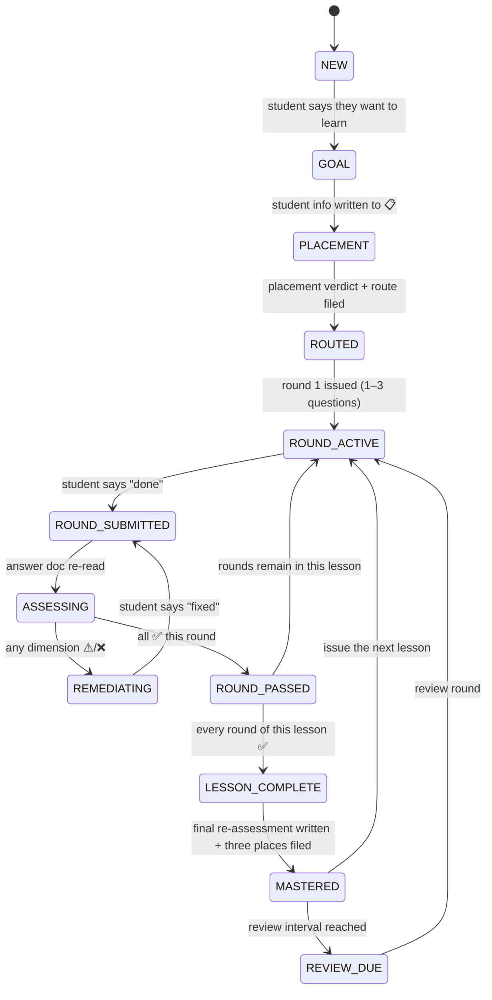

# 04_State Machine

> Purpose: turn "what should the tutor do right now" from **prose advice** into **decidable states**.
> Each state states three things: **entry condition** (how you know you're here), **allowed actions**, and **invariants** (what must hold on disk).
> Invariants are mechanically checked by [`../_tools/validate-state.mjs`](../_tools/validate-state.mjs) — violations get reported by a tool instead of relying on self-discipline.
> Chinese version: [`04_状态机.md`](./04_状态机.md)

---

## 1. Why a state machine

The project's flow used to live only in scattered prose ("handover order", "main loop", "when to file").
Prose describes **sequence**, but cannot describe **what is forbidden right now** — and that is exactly where violations happen:

| A mistake that really happens | Only a state machine stops it |
|---|---|
| Publishing the next lesson before the current one passed | Requires the previous lesson to be in `MASTERED` to enter `ROUND_ACTIVE` |
| Mastery table says ✅ but the answer doc has no re-assessment verdict | Requires `MASTERED` to have on-disk evidence |
| Student says "done" and the tutor grades from memory | Requires re-reading the file before leaving `ROUND_SUBMITTED` |
| Dumping all of a lesson's questions at once | `ROUND_ACTIVE` holds at most 1–3 questions |

**Core idea: a state is not a label for yourself — it is a licence for actions.**

---

## 2. State overview



---

## 3. State definitions

| State | Entry condition (on-disk evidence) | Allowed actions | Forbidden actions |
|---|---|---|---|
| **`NEW`** | `我的学习/00-学习档案.md` exists and is still the blank template | Requirements gathering | Issuing questions or lessons |
| **`GOAL`** | 📋 Student info filled (what / why / goal / daily time) | Probing, writing 📋 | Placement (goal not confirmed yet) |
| **`PLACEMENT`** | Placement test file created | Issuing per [`01_摸底剧本.md`](./01_摸底剧本.md), grading | Publishing formal lessons |
| **`ROUTED`** | `00-摸底测试.md` has a verdict + `00-课程路线.md` lays out the first 3–5 lessons | Publishing lesson 1 | Skipping the route and starting a lesson |
| **`ROUND_ACTIVE`** | Current lesson's teaching + answer docs exist; answer doc holds **unanswered** questions | Waiting for the student | Appending the next round, issuing the next lesson |
| **`ROUND_SUBMITTED`** | Student said "done" (transient) | Re-reading the answer doc | **Grading from conversation memory** (must re-read to leave this state) |
| **`ASSESSING`** | Answer doc has been re-read (transient) | 3-dimension assessment of every question this round, all at once | Skipping questions, drip-feed corrections |
| **`REMEDIATING`** | At least one applicable dimension is not ✅ | Direct fix + three-part explanation for small issues; Socratic guidance for big ones | Advancing, publishing the next lesson |
| **`ROUND_PASSED`** | All three dimensions ✅ for this round | Filing the round, appending the next round | Jumping to `MASTERED` while rounds remain |
| **`LESSON_COMPLETE`** | Every round of this lesson ✅ | Writing "Final Re-assessment" + "Correct Answers & Analysis" | Editing the profile before the verdict exists |
| **`MASTERED`** | Answer doc has a **filled-in** final re-assessment + 📊 marked ✅ | Issuing the next lesson, updating 🚦 | Editing the student's historical answers |
| **`REVIEW_DUE`** | ⏳ To-do table holds a due review/Feynman item | Issuing review questions, re-running Feynman | Re-teaching it as a brand-new topic |

---

## 4. Invariants (what the checker actually verifies)

> These 10 are the checking criteria of `validate-state.mjs`. The IDs are used in error messages.

### Structural

| # | Invariant | Consequence of violation |
|---|---|---|
| **I1** | Profile contains five sections: 📋 Student info / 🚦 Handoff Status / 📊 Mastery table / ⏳ To-do / 📚 Lesson index | Handover reads no state |
| **I2** | A blank-template profile (contains "（尚未开始）") is treated as `NEW`; remaining checks skipped | False positives |

### Path

| # | Invariant | Consequence of violation |
|---|---|---|
| **I3** | Paths in 🚦 (`教学文档` / `回答文档`) **exist** | Handover cannot find the files |
| **I4** | Every path in the 📚 lesson index **exists** | Index becomes dead links |
| **I5** | Paths in the ⏳ `证据入口` column **exist** | Pending items become untraceable |

### Evidence (the most important)

| # | Invariant | Consequence of violation |
|---|---|---|
| **I6** | A topic marked `✅ 已掌握` in 📊 must have an answer doc containing a **filled-in** "最终复评结果" | ← **false mastery claim**, the worst error in this project |
| **I7** | In that verdict's 3-dimension table, all applicable dimensions are ✅ | Self-contradicting state (table says ⚠️, profile says ✅) |
| **I8** | A ✅ row's `评估日期` is a real date (not a placeholder or empty) | Cannot trace when it was mastered |

### Ordering

| # | Invariant | Consequence of violation |
|---|---|---|
| **I9** | For current lesson `#N`, topics `#1..#N-1` in 📚 are **not** `⏳ 待作答` in 📊 | ← **premature advance**, moving on before mastery |
| **I10** | The ⏳ To-do table must not contain "the lesson currently running" | Duplicated state; handover cannot tell which is authoritative |

> **Verdict**: any invariant failing → validation fails (exit code 1). Conflict precedence is in [`03_落档事件表.md`](./03_落档事件表.md) section 4.

---

## 5. How to use it

```bash
node _tools/validate-state.mjs                 # validate this repo's 我的学习/
node _tools/validate-state.mjs --root <dir>    # validate any learning folder
node _tools/validate-state.mjs --fixtures tests/fixtures   # run the regression suite
node _tools/validate-state.mjs --json          # machine-readable output
```

Both `npm run verify` and CI run it — **a broken invariant fails the build**.

---

## 6. Boundary (what it deliberately does not check)

| Not checked | Why |
|---|---|
| Whether the 3-dimension assessment was **graded correctly** | That is the tutor's judgement and needs semantics; the tool only checks "the assessment exists and is self-consistent" |
| Whether question difficulty was appropriate | Also a teaching judgement |
| Whether a topic **deserves** ✅ | The tool asks "is there evidence", not "does it qualify" |
| Historical data not referenced by the profile | No evidence chain to trace |

> In one line: **the checker governs self-consistency and evidence, not teaching quality.** The two complement each other.

---

## 7. Related files

| To learn | Read |
|---|---|
| Teaching rules and rhythm | [`00_导师协议.md`](./00_导师协议.md) |
| When to write which file | [`03_落档事件表.md`](./03_落档事件表.md) |
| How placement questions are written | [`01_摸底剧本.md`](./01_摸底剧本.md) |
| Document skeletons for a new lesson | [`02_新课模板.md`](./02_新课模板.md) |
| The single source of state (student data) | `我的学习/00-学习档案.md` |
