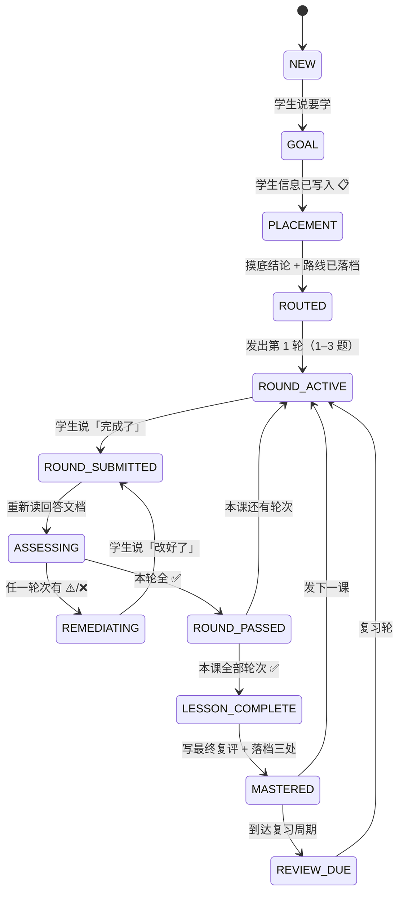

# 04_状态机（State Machine）

> 用途：把「导师现在该干什么」从**文字建议**变成**可判定的状态**。
> 每个状态说明三件事：**进入条件**（怎么算到了这一步）、**允许动作**（现在能做/该做）、**不变式**（磁盘上必须成立什么）。
> 不变式由 [`../_tools/validate-state.mjs`](../_tools/validate-state.mjs) 机械校验 —— 违反会被工具报错，不靠自觉。
> 英文版：[`04_状态机.en.md`](./04_状态机.en.md)

**当前协议版本：1**（档案 📋 学生信息里的「协议版本」那一行；升级流程见 [`../docs/UPGRADE.md`](../docs/UPGRADE.md)）

---

## 1. 为什么需要状态机

本项目的流程原本只写在散落的文字里（「接手顺序」「主循环」「落档时机」）。
文字能描述**顺序**，但描述不了**「现在禁止做什么」**——而违规恰恰都发生在这一侧：

| 真实会犯的错 | 只有状态机才拦得住 |
|---|---|
| 上一课还没通过，就发了下一课 | 要求「上一课处于 `MASTERED`」才能进 `ROUND_ACTIVE` |
| 掌握表标了 ✅，但回答文档里没有复评结论 | 要求 `MASTERED` 有磁盘证据 |
| 学生说「完成了」但导师凭记忆评估 | 要求先重新读文件才能离开 `ROUND_SUBMITTED` |
| 一次把一课的题全发出去 | `ROUND_ACTIVE` 一次只装 1–3 题 |

**核心思想：状态不是给自己看的标签，是「动作的许可证」。**

---

## 2. 状态总览



---

## 3. 状态定义表

| 状态 | 进入条件（磁盘证据） | 允许动作 | 禁止动作 |
|---|---|---|---|
| **`NEW`** | `我的学习/00-学习档案.md` 存在且仍是空模板 | 需求收集 | 出题、发课 |
| **`GOAL`** | 📋 学生信息已填（学什么/为什么/目标/每天投入） | 追问需求、写 📋 | 摸底（还没确认目标） |
| **`PLACEMENT`** | 摸底测试文档已建 | 按 [`01_摸底剧本.md`](./01_摸底剧本.md) 出题、评卷 | 发正式课 |
| **`ROUTED`** | `00-摸底测试.md` 有结论 + `00-课程路线.md` 已排前 3–5 课 | 发第一课 | 跳过路线直接开课 |
| **`ROUND_ACTIVE`** | 当前课的教学文档 + 回答文档存在；回答文档含**未作答**的题目 | 等学生作答 | 追加下一轮、发下一课 |
| **`ROUND_SUBMITTED`** | 学生说了「完成了」（瞬态） | 重新读回答文档 | **凭对话记忆评估**（必须重读后才能离开本态） |
| **`ASSESSING`** | 回答文档已重读（瞬态） | 三维评估本轮全部题目、一次列全 | 漏题、挤牙膏式纠错 |
| **`REMEDIATING`** | 本轮至少一个适用维度不是 ✅ | 小问题代改 + 三段式；大问题 Socratic 引导 | 推进、发新课 |
| **`ROUND_PASSED`** | 本轮三维全 ✅ | 落档本轮结果、追加下一轮 | 直接跳 `MASTERED`（本课还有轮次时） |
| **`LESSON_COMPLETE`** | 本课全部轮次 ✅ | 写「最终复评结果」+「正确答案与解析」 | 漏写复评就改档案 |
| **`MASTERED`** | 回答文档有**已填写**的最终复评 + 📊 已标 ✅ | 发下一课、更新 🚦 | 修改学生历史答案 |
| **`REVIEW_DUE`** | ⏳ 待办表出现到期的复习/费曼项 | 出复习题、重讲费曼 | 当作新知识点重教一遍 |

---

## 4. 不变式（校验器实际检查的条目）

> 这 12 条是 `validate-state.mjs` 的判定口径。编号用于报错信息引用。
### 结构类

| # | 不变式 | 违反后果 |
|---|---|---|
| **I1** | 档案含五个区块：📋 学生信息 / 🚦 交接状态 / 📊 掌握表 / ⏳ 待办 / 📚 课次索引 | 接手时读不到状态 |
| **I2** | 空模板档案视为 `NEW`，其余检查跳过。**判据是结构，不是关键词**：必须 🚦 / 📊 / 📚 三处**都还没填真实值**；正文别处提到「尚未开始」不算 | 已开课的档案被误判成空模板 → **静默跳过全部检查** |
| **I12** | 档案的「协议版本」不得高于本工具支持的版本（当前 1） | 用旧口径校验新协议 → 给出假的安全感 |

### 路径类

| # | 不变式 | 违反后果 |
|---|---|---|
| **I3** | 🚦 里的 `教学文档` / `回答文档` 路径**存在**，且在**学习目录之内** | 接手时找不到文件 |
| **I4** | 📚 课次索引里的每个路径**存在**且在目录之内 | 索引变死链 |
| **I5** | ⏳ 待办表 `证据入口` 列的路径**存在**且在目录之内 | 待办无法追溯 |

> **目录边界（I3–I6 共用）**：所有路径类证据都必须落在被校验的根目录之内。
> `../../别人的档案.md` 这种路径即使真实存在也不算证据 —— 否则就成了「校验 A 目录、采信 B 目录的文件」。

### 证据类（最重要）

| # | 不变式 | 违反后果 |
|---|---|---|
| **I6** | 📊 标 `✅ 已掌握` 的知识点，其回答文档必须含**结构完整的**「最终复评结果」：① 真实日期的「复评日期」② 非空话的「最终结论」③ 至少一行题目、且有可辨认的维度列 | ← **谎报掌握**，本项目最严重的错误 |
| **I7** | 该复评表里适用维度**全部**是 ✅，且**没有空白格** | 状态自相矛盾（表里 ⚠️/空，档案标 ✅） |
| **I8** | 📊 标 ✅ 的行，`评估日期` 是**日历上真实存在**的日期（不是占位/空，也不是 `2026-02-31`） | 无法追溯何时掌握 |
| **I11** | 回答文档里「最终复评结果」「正确答案与解析」**各只出现 1 次**，且无残留模板占位块 | 同一信息写多处，接手时不敢确定哪份准 |

### 顺序类

| # | 不变式 | 违反后果 |
|---|---|---|
| **I9** | 🚦 当前课次 `#N` → 📚 里 `#1..#N-1` 的知识点在 📊 中**不是** `⏳ 待作答` | ← **提前推进**，学生没掌握就往下走 |
| **I10** | ⏳ 待办表不得出现「当前正在上的课」（含**只写一个路径**、只写课次/课名的写法）；「间隔复习 / 费曼重讲」等复习语义豁免 | 三处状态重复，接手时不敢确定哪份准 |

### ⚠️ 两档强度：**失败** vs **提示**（I3 / I9 特殊）

上表是「违反 = 失败」。但 I3 与 I9 各有一个**合法的降级情形** —— 课间中间态
（上一课已完成、下一课未发布，见 [`03_落档事件表.md`](./03_落档事件表.md) 第 6 节）。

| 强度 | 什么情况 | 退出码 | 涉及 |
|---|---|---|---|
| **失败（problem）** | 路径指向的文件**真的不存在**；🚦 当前课**已开课**但 📚 里没有它 | `1` | I3 / I9 |
| **提示（warning）** | 路径是**带说明的占位**（如 `—（#2 尚未发布）`）；📚 索引还没加下一课 | `0` | I3 / I9 |

> **判据**：**「没到时候」= 提示；「该有却没有」= 失败。**
> 例如 🚦 写 `—（#2 尚未发布）` 而 #2 确实未发布 → 提示；
> 🚦 写了真实路径但文件找不到 → 失败。
> 其余 10 条不变式**没有降级档**，违反即失败。

> **判定**：任一不变式在**失败档**不成立 → 校验失败（退出码 1）。冲突时的优先级见 [`03_落档事件表.md`](./03_落档事件表.md) 第 4 节。

> **I11 的由来**：弱模型兼容性测试（`docs/weak-model/WEAK-MODEL-REPORT.md` §3.0）中，
> 一个最低档小模型在文档中间正确写出了最终复评，却**忘了删掉模板自带的空占位块** →
> 同一份文档出现两份「最终复评结果」。当时的 10 条不变式**全部抓不到**（I6 只找第一个小节、填了就过），
> 所以补了 I11。这是本项目「先有真实失误、才加规则」的一例。

> **I2 / I6 / I7 / I8 / I10 / I12 的由来（2026-09 加固）**：一次自审发现六处「能靠格式混过」的缺口，
> 全部是**宽松判定**造成的：关键词判空模板、只看有没有「最终结论」四个字、空表当「无失败」、
> 日期只验格式、待办重复只认双路径、无版本握手。每一条都配了回归用例（`tests/fixtures/08..17`），
> 其中 `08-blank-marker-in-progress` 最危险：它会让**全部检查被静默跳过**。

---

## 5. 怎么用

```bash
node _tools/validate-state.mjs                 # 校验本仓库 我的学习/
node _tools/validate-state.mjs --root <目录>   # 校验任意学习目录
node _tools/validate-state.mjs --fixtures tests/fixtures   # 跑回归测试集
node _tools/validate-state.mjs --json          # 机器可读输出
```

`npm run verify` 与 CI 都会跑它 —— **违反不变式 = 构建失败**。

> **学习者不需要装 Node。** 上面的命令是给维护者和 CI 用的；
> 学生只要在用满一段时间后想自查，也可以（可选）。

---

## 6. 边界（明确不检查的事）

| 不检查 | 原因 |
|---|---|
| 三维评估**判得对不对** | 那是导师的判断，需要语义理解；工具只校验「评估存在且自洽」 |
| 题目难度是否合适 | 同理，属于教学判断 |
| 📊 里某个知识点是否**应该**标 ✅ | 工具只问「有没有证据」，不问「配不配」 |
| 未引用档案的历史数据 | 没有证据链可追溯，无从校验 |
| 资料内容本身对不对 | 参见 [`../资料/README.md`](../资料/README.md) 的索引与引用规范 |

> 一句话：**校验器管「自洽性与证据」，不管「教学质量」。** 两者互补，不互相替代。

---

## 7. 相关文件

| 想知道什么 | 读哪个 |
|---|---|
| 教学规则与节奏 | [`00_导师协议.md`](./00_导师协议.md) |
| 什么时候写哪个文件 | [`03_落档事件表.md`](./03_落档事件表.md) |
| 摸底怎么出题 | [`01_摸底剧本.md`](./01_摸底剧本.md) |
| 新课的文档骨架 | [`02_新课模板.md`](./02_新课模板.md) |
| **升级框架时怎么迁移旧档案** | [`../docs/UPGRADE.md`](../docs/UPGRADE.md) |
| **多学科并行时怎么记状态** | [`03_落档事件表.md`](./03_落档事件表.md) 第 7 节 |
| 状态的唯一出处（学生数据） | `我的学习/00-学习档案.md` |
