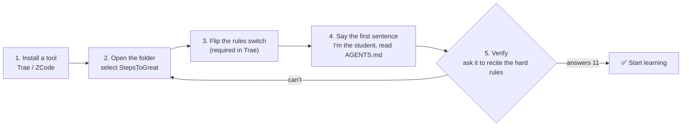
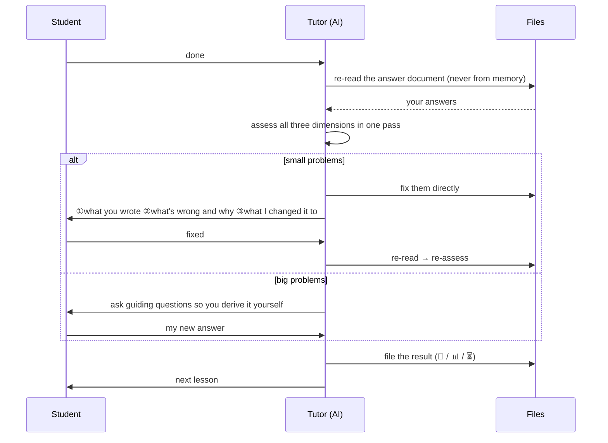
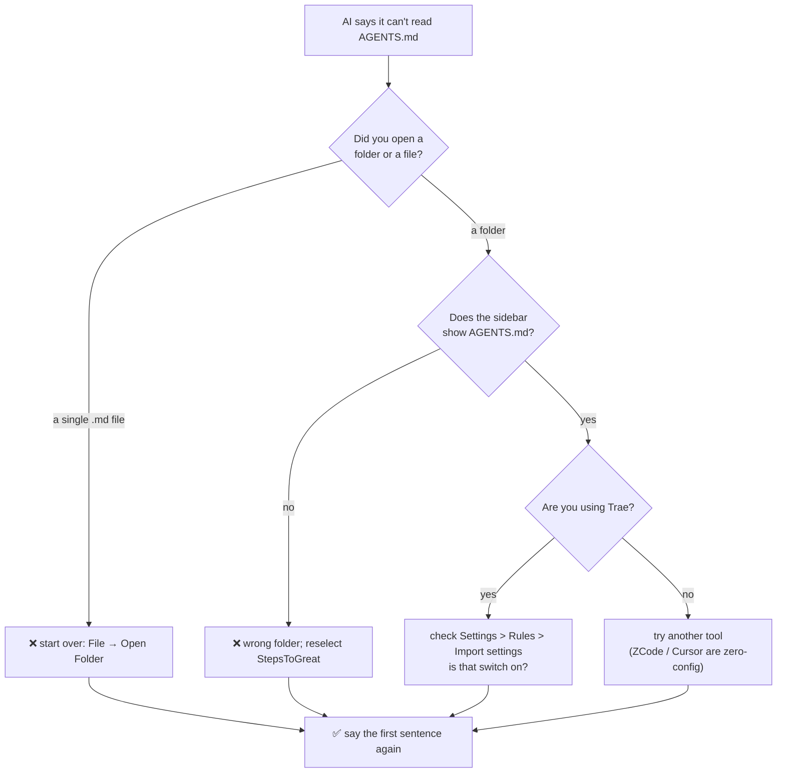

# UI Mockups (no screenshots)

> This file uses **plain-text mockups** instead of screenshots. Why:
> ① screenshots go stale (a UI redesign kills them); mockups describe the **operation path**, which doesn't;
> ② plain Markdown changes together with the docs and can be read by AI;
> ③ GitHub / Obsidian / VS Code all render it natively.
> Chinese version: [`界面示意图.md`](./界面示意图.md)

---

## ⚠️ Read this first: these are "mockups", not screenshots

The ASCII boxes below are **reconstructed from the menu paths stated in each vendor's official docs**
(e.g. "Settings > Rules > Import settings"). They show **what to click and in what order**.

**They are not pixel-accurate copies of the real UI.** Layout, wording and position may differ
from what you see after opening the app.

So:

| What to trust | Note |
|---|---|
| ✅ **The text path** (e.g. `Settings → Rules → Import settings → turn on "Include AGENTS.md in context"`) | Taken from official docs — **this is authoritative** |
| ⚠️ The ASCII box layout and wording | Only helps build spatial intuition; **may differ from reality** |

**If you can't find a menu**: search the settings for `AGENTS.md`, `Rules`, or `规则`,
or search the same keyword in the official docs. **Don't assume the step is wrong just because the UI looks different.**

---

## 0. The whole journey (one diagram)



> Remember: **you can only get stuck at step 2 or step 3.**

---

## 1. Download Trae (official site)

```
┌──────────────────────────────────────────────────────────────┐
│  https://www.trae.cn                                   ─ □ ✕ │
├──────────────────────────────────────────────────────────────┤
│                                                              │
│  Trae                                    Products ▾  Pricing  │
│                                                              │
│           AI-native integrated development environment       │
│           From idea to production, on your own               │
│                                                              │
│              [ Download now ]    [ Read the docs ]           │
│                    ↑                                         │
│              【click here】                                   │
│                                                              │
│  Windows 10/11 · macOS · Linux                                │
└──────────────────────────────────────────────────────────────┘
```

**What to do**: open `https://www.trae.cn` in a browser → click "Download now" → choose **Windows** → you get an `.exe`.

---

## 2. Installation

```
┌──────────────────────────────────────────────────────────────┐
│  Install - Trae                                        ─ □ ✕ │
├──────────────────────────────────────────────────────────────┤
│                                                              │
│  Choose install location                                     │
│                                                              │
│    C:\Users\<you>\AppData\Local\Programs\Trae                │
│                                              [ Browse... ]   │
│                                                              │
│    [x] Create a desktop shortcut                             │
│                                                              │
│                  [ Next > ]      [ Cancel ]                  │
└──────────────────────────────────────────────────────────────┘
```

**What to do**: double-click the `.exe` → click "Next" all the way through.

> ⚠️ If Windows shows "Windows protected your PC", click "More info" → "Run anyway".
> (Common for open-source / independent software — not a virus.)

---

## 3. Log in

```
┌──────────────────────────────────────────────────────────────┐
│  Trae sign-in                                          ─ □ ✕ │
├──────────────────────────────────────────────────────────────┤
│                                                              │
│                   Welcome to Trae                            │
│                                                              │
│         [ Sign in with phone number ]                        │
│                                                              │
│         [ Sign in with WeChat QR code ]                      │
│                                                              │
│      ✅ no credit card needed   ✅ free tier available        │
└──────────────────────────────────────────────────────────────┘
```

**What to do**: sign in with your phone number or the WeChat QR code.

---

## 4. Open the folder ⭐ the easy step to get wrong

```
┌──────────────────────────────────────────────────────────────┐
│  Trae                                              ─  □  ✕   │
├──────────────────────────────────────────────────────────────┤
│  File(F)  Edit(E)  View(V)  Run(R)  Terminal(T)  Help(H)      │
│                                                              │
│  ┌───────────────────────────┐                               │
│  │ New Text File             │                               │
│  │ Open File...       Ctrl+O │                               │
│  │ Open Folder...     Ctrl+K │  ← 【click THIS, not "Open File"】│
│  │ Open Recent               │                               │
│  │ ───────────────────────── │                               │
│  │ Save               Ctrl+S │                               │
│  └───────────────────────────┘                               │
│                                                              │
│  Welcome                                                     │
│  Recent projects                                             │
└──────────────────────────────────────────────────────────────┘
```

**What to do**: `File → Open Folder` → in the dialog, select the **whole `StepsToGreat` folder**.

```
┌──────────────────────────────────────────────────────────────┐
│  Select Folder                                         ─ □ ✕ │
├──────────────────────────────────────────────────────────────┤
│  This PC  ▾  E:  ▾                                           │
│                                                              │
│  📁 AITutorKit      📁 playground                            │
│  📁 StepsToGreat  ←──── 【select this folder, then "Select Folder"】│
│  📁 other projects                                           │
│                                                              │
│                              [ Select Folder ]               │
└──────────────────────────────────────────────────────────────┘
```

> ❌ **Common mistake**: clicking "Open File" and picking a single `.md` file.
> Then the AI sees only one file, can't read the project, and every rule silently fails.
>
> ✅ **Correct**: select a **folder**. After opening, the sidebar should show `AGENTS.md`, `协议/`, `我的学习/`, etc.

After a successful open, the file tree on the left should look like this:

```
┌───────────────────────────────┐
│ Explorer                      │
├───────────────────────────────┤
│ ▾ 📁 STEPSTOGREAT              │
│   📄 AGENTS.md  ← you need this│
│   📁 协议/                     │
│   📁 学科包/                   │
│   📁 模板/                     │
│   📁 教程/                     │
│   📁 我的学习/                 │
│   📁 资料/                     │
│   📁 _tools/                   │
└───────────────────────────────┘
```

---

## 5. Flip the rules switch ⭐⭐ the most critical step; 90% of people miss it

Trae does **not** read `AGENTS.md` by default. You must turn it on manually.

```
┌──────────────────────────────────────────────────────────────┐
│  Trae Settings                                         ─ □ ✕ │
├────────────────────┬─────────────────────────────────────────┤
│                    │                                         │
│  General           │  Rules                                  │
│  Editor            │                                         │
│  AI                │  Rules file                             │
│  Rules       ◀──┐  │                                         │
│  Shortcuts      │  │    Import settings                      │
│  Network        │  │                                         │
│  Privacy        │  │      [x] Include AGENTS.md in context   │
│  About          │  │            ↑                            │
│                 │  │      【turn this switch ON】             │
│  ↑              │  │                                         │
│ 【click here first】│     [ ] Include CLAUDE.md in context    │
│                 │  │                                         │
│                 │  │                        [ Save ]         │
└────────────────────┴─────────────────────────────────────────┘
```

**What to do (three steps)**:

```
Settings (gear ⚙, bottom-left) → Rules → Import settings → turn on "Include AGENTS.md in context"
```

**Do other tools need this?**

| Tool | Need the switch? |
|---|---|
| **Trae** | ✅ **Yes** (the one above) |
| ZCode / Codex / Cursor / Qoder / Cline / Zed | ❌ No, zero configuration |
| Claude Code / CodeBuddy / Gemini CLI | ❌ No, this project ships pointer files |

---

## 6. Say the first sentence

```
┌──────────────────────────────────────────────────────────────┐
│  Trae                                              ─  □  ✕   │
├────────────────────┬─────────────────────────────────────────┤
│ Explorer           │  New chat                            ⋯  │
│ ▾ 📁 STEPSTOGREAT   │                                         │
│   📄 AGENTS.md     │  ┌───────────────────────────────────┐  │
│   📁 协议/         │  │ I'm the student. Please read      │  │
│   📁 学科包/       │  │ AGENTS.md first, then begin.      │  │
│   📁 我的学习/     │  └───────────────────────────────────┘  │
│                    │                  [ Send ]               │
│                    │                                         │
│                    │  copy this line ↑ and paste it in       │
└────────────────────┴─────────────────────────────────────────┘
```

**What to do**: copy this sentence verbatim, paste it into the chat box, press Enter:

```
I'm the student. Please read AGENTS.md first, then begin.
```

---

## 7. Verify it really read them ⭐ the only reliable check

Many tools have **no** "show loaded rules" screen, so you ask it to recite them:

```
┌──────────────────────────────────────────────────────────────┐
│  You: Recite the "Hard rules" section of AGENTS.md —          │
│       how many are there?                                     │
│                                                               │
│  AI:  AGENTS.md's "Hard rules" has 11 items:                  │
│       1. When the student says "done" → re-read the answer    │
│          document before assessing; never judge from memory   │
│       2. Assess all of **this round's** questions in one      │
│          pass; no drip-feeding corrections                    │
│       3. Small problems: the tutor fixes them directly (with  │
│          the three-part explanation); big problems stay       │
│          Socratic                                             │
│       4. File by round: append this round's result; write the │
│          final re-assessment and update the profile only      │
│          when the whole lesson passes                         │
│       5. Read a file before editing it                        │
│       6. Each round has 1–3 questions; next round only when   │
│          this round is all ✅                                 │
│       7. Settle preferences in one go, but practice questions │
│          go round by round                                    │
│       8. Never invent content — teaching must be grounded;    │
│          if unsure, say so                                    │
│       9. Use the Feynman technique as a diagnostic (adaptive  │
│          frequency; always once at a major module's end)      │
│      10. Do not modify 协议/ 模板/ 学科包/ _tools/            │
│      11. Rule-level requests → write them into 我的规则.md,   │
│          never edit the framework                             │
│                                                               │
│      ✅ I've read the protocol and I'm ready.                 │
│         What would you like to learn?                         │
└──────────────────────────────────────────────────────────────┘
```

| Result | Verdict | Next step |
|---|---|---|
| Answers **11** | ✅ all good | just say "I want to learn X" |
| Can't / says file not found | ❌ rules not active | back to step 4 (did you open the folder?) → step 5 (is the switch on?) |
| Vague, wrong count | ⚠️ partially active | try another tool, or paste `AGENTS.md` in manually |

---

## 8. From then on you only say two things

```
┌──────────────────────────────────────────────────────────────┐
│                                                              │
│  Want to continue      →    "continue"                        │
│                                                              │
│  Finished the homework →    "done"        ← most common      │
│                                                              │
└──────────────────────────────────────────────────────────────┘
```

When the AI hears "done", it runs the full loop automatically:



---

## 9. When something breaks, start with this diagram



---

## 10. Why mockups instead of screenshots

| Screenshots | Mockups (this file) |
|---|---|
| Go stale on any redesign | Describe the **operation path**; durable |
| Binary, can't be diffed | Plain text: versionable, reviewable |
| Hard to read on a phone | Scalable, searchable, copyable |
| Need someone to re-shoot them | Written and edited together with the docs |
| Unreadable by AI (weak models) | AI can read the text directly, **and teach the user from it** |

> This is the "Markdown is the single source of truth" principle extended to tutorial illustrations.
