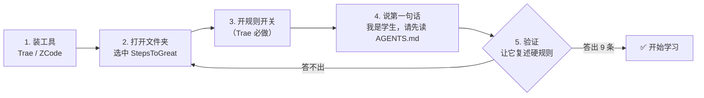
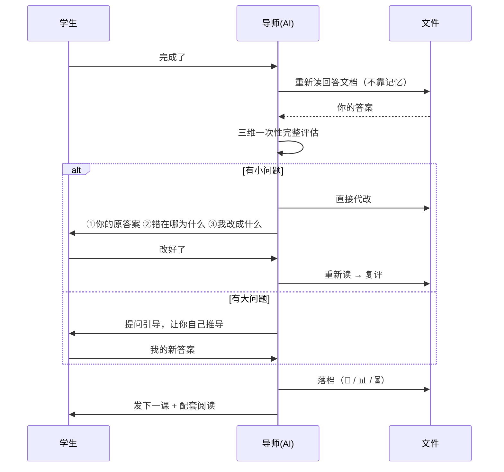
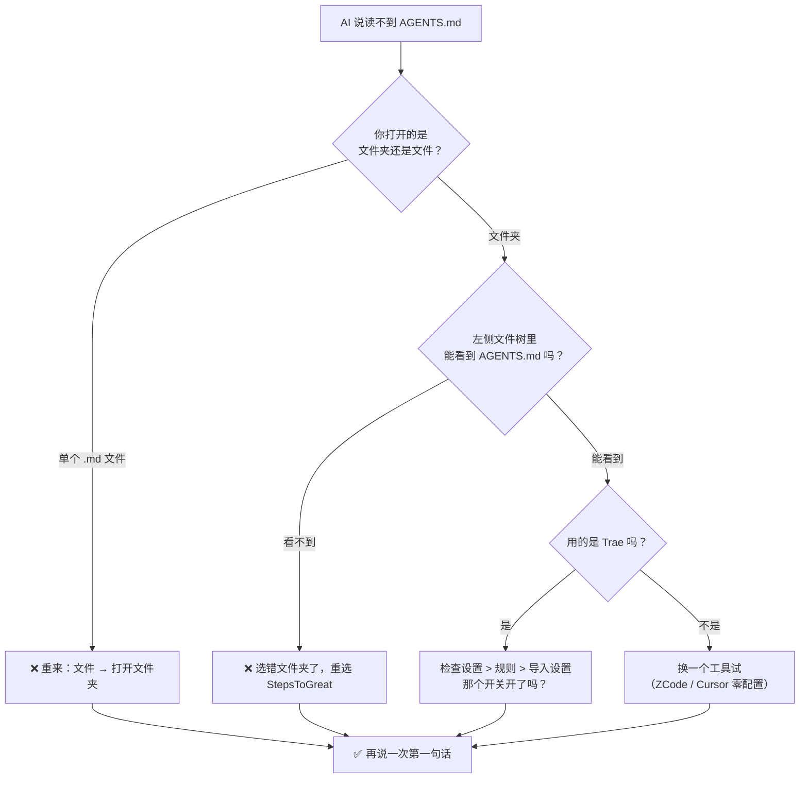

# 界面示意图（无截图版）

> 本文件用**纯文本示意图**代替截图。理由：
> ① 截图会过时（软件改版就废了），示意图写的是**操作路径**，不会过时；
> ② 纯 Markdown 能随文档一起改、一起被 AI 读；
> ③ GitHub / Obsidian / VS Code 都能原生渲染。
> English version: [`ui-mockups.en.md`](./ui-mockups.en.md)

---

## ⚠️ 先读这条：这些图是「示意图」，不是界面截图

下面的 ASCII 框图是**根据各软件官方文档里写明的菜单路径**（如「设置 > 规则 > 导入设置」）
**重构出来的示意**，用来表达**点哪里、按什么顺序**。

**它们不是真实界面的像素级复制**，可能与你打开软件后看到的**排版、措辞、位置**有出入。

因此：

| 请以什么为准 | 说明 |
|---|---|
| ✅ **文字路径**（如 `设置 → 规则 → 导入设置 → 打开「将 AGENTS.md 包含在上下文中」`） | 这是从官方文档摘录的，**以它为准** |
| ⚠️ ASCII 框图的排版与措辞 | 仅帮助建立空间感，**可能与实际不同** |

**找不到对应菜单时**：优先在设置里搜索关键词 `AGENTS.md`、`规则`、`Rules`，
或在官方文档里搜同样的关键词。**不要因为界面长得不一样就以为步骤错了。**

---

## 0. 全程路线（一张图看懂）



> 记住：**卡住只可能是第 2 步或第 3 步**。

---

## 1. 下载 Trae（官网）

```
┌──────────────────────────────────────────────────────────────┐
│  https://www.trae.cn                                    ─ □ ✕ │
├──────────────────────────────────────────────────────────────┤
│  Trae                                    产品 ▾  定价  文档   │
│                                                              │
│          AI 原生集成开发环境                                  │
│          从想法到上线，一个人也能完成                          │
│                                                              │
│            ┌─────────────┐   ┌─────────────┐                 │
│            │  立即下载   │   │  查看文档   │                 │
│            └─────────────┘   └─────────────┘                 │
│                ↑                                             │
│           【点这里】                                          │
│                                                              │
│   支持 Windows 10/11 · macOS · Linux                          │
└──────────────────────────────────────────────────────────────┘
```

**要做的**：浏览器打开 `https://www.trae.cn` → 点「立即下载」→ 选 **Windows** → 得到 `.exe`

---

## 2. 安装

```
┌──────────────────────────────────────────────────────────────┐
│  安装 - Trae                                           ─ □ ✕ │
├──────────────────────────────────────────────────────────────┤
│                                                              │
│   选择安装位置                                                │
│   ┌────────────────────────────────────────────────┐         │
│   │ C:\Users\<你>\AppData\Local\Programs\Trae      │         │
│   └────────────────────────────────────────────────┘         │
│                                          [ 浏览... ]         │
│                                                              │
│    ☑ 创建桌面快捷方式                                         │
│                                                              │
│              ┌──────────┐   ┌──────────┐                     │
│              │ 下一步 > │   │  取消    │                     │
│              └──────────┘   └──────────┘                     │
└──────────────────────────────────────────────────────────────┘
```

**要做的**：双击 `.exe` → 一路「下一步」。

> ⚠️ 如果 Windows 弹出「已保护你的电脑」，点「更多信息」→「仍要运行」。
> （开源/独立软件常见，不是病毒。）

---

## 3. 登录

```
┌──────────────────────────────────────────────────────────────┐
│  Trae 登录                                             ─ □ ✕ │
├──────────────────────────────────────────────────────────────┤
│                                                              │
│                    欢迎使用 Trae                              │
│                                                              │
│              ┌────────────────────────────┐                  │
│              │   手机号登录                │                  │
│              └────────────────────────────┘                  │
│              ┌────────────────────────────┐                  │
│              │   微信扫码登录              │                  │
│              └────────────────────────────┘                  │
│                                                              │
│      ✅ 不需要信用卡   ✅ 免费档可用                           │
└──────────────────────────────────────────────────────────────┘
```

**要做的**：手机号或微信扫码登录。

---

## 4. 打开文件夹 ⭐ 容易错的一步

```
┌──────────────────────────────────────────────────────────────┐
│  Trae                                          ─  □  ✕       │
├──────────────────────────────────────────────────────────────┤
│  文件(F)  编辑(E)  查看(V)  运行(R)  终端(T)  帮助(H)         │
│  ┌───────────────────────┐                                   │
│  │ 新建文本文件          │                                   │
│  │ 打开文件...      Ctrl+O│                                   │
│  │ 打开文件夹...    Ctrl+K│  ← 【点这个，不是"打开文件"】      │
│  │ 最近打开              │                                   │
│  │ ───────────────────── │                                   │
│  │ 保存              Ctrl+S│                                  │
│  └───────────────────────┘                                   │
│                                                              │
│   欢迎页                                                      │
│   最近的项目                                                  │
└──────────────────────────────────────────────────────────────┘
```

**要做的**：`文件 → 打开文件夹` → 在弹出的选择框里选中 **`StepsToGreat` 整个文件夹**。

```
┌──────────────────────────────────────────────────────────────┐
│  选择文件夹                                            ─ □ ✕ │
├──────────────────────────────────────────────────────────────┤
│  此电脑  ▾  E:  ▾                                            │
│                                                              │
│   📁 AITutorKit        📁 playground                         │
│   📁 StepsToGreat  ←──── 【选中这个文件夹，然后点"选择文件夹"】│
│   📁 其它项目                                                │
│                                                              │
│                          ┌────────────────┐                  │
│                          │  选择文件夹    │                  │
│                          └────────────────┘                  │
└──────────────────────────────────────────────────────────────┘
```

> ❌ **常见错误**：点「打开文件」选了一个 `.md` 文件。
> 那样 AI 只看到一个文件，读不到整个项目，规则全部失效。
>
> ✅ **正确**：选的是**文件夹**，打开后左侧应该能看到 `AGENTS.md`、`协议/`、`我的学习/` 等。

打开成功后，左侧文件树应该长这样：

```
┌─────────────────────┐
│ 资源管理器          │
├─────────────────────┤
│ ▾ 📁 STEPSTOGREAT   │
│   📄 AGENTS.md   ← 有这个才对  │
│   📁 协议/          │
│   📁 学科包/        │
│   📁 模板/          │
│   📁 教程/          │
│   📁 我的学习/      │
│   📁 资料/          │
│   📁 _tools/        │
└─────────────────────┘
```

---

## 5. 打开规则开关 ⭐⭐ 最关键，90% 的人卡在这

Trae **默认不读** `AGENTS.md`，必须手动打开。

```
┌──────────────────────────────────────────────────────────────┐
│  Trae 设置                                             ─ □ ✕ │
├──────────────┬───────────────────────────────────────────────┤
│              │                                               │
│ 通用         │  规则                                          │
│ 编辑器       │  ┌─────────────────────────────────────────┐  │
│ AI           │  │ 规则文件                                 │  │
│ 规则      ◀──┼──│                                         │  │
│ 快捷键       │  │  导入设置                                │  │
│ 网络         │  │  ┌───────────────────────────────────┐  │  │
│ 隐私         │  │  │ ☑ 将 AGENTS.md 包含在上下文中  ◀━━━━┫  │  │
│ 关于         │  │  │   ↑                              │  │  │
│              │  │  │  【把这个开关打开】               │  │  │
│  ↑           │  │  └───────────────────────────────────┘  │  │
│ 【先点这里】  │  │                                         │  │
│              │  │  ☑ 将 CLAUDE.md 包含在上下文中          │  │
│              │  └─────────────────────────────────────────┘  │
│              │                                               │
│              │              ┌──────────┐                   │
│              │              │   保存   │                   │
│              │              └──────────┘                   │
└──────────────┴───────────────────────────────────────────────┘
```

**要做的（三步）**：

```
设置（左下角齿轮 ⚙） → 规则 → 导入设置 → 打开「将 AGENTS.md 包含在上下文中」
```

**别的工具要不要这一步？**

| 工具 | 要开开关吗 |
|---|---|
| **Trae** | ✅ **要**（就是上面这个） |
| ZCode / Codex / Cursor / Qoder / Cline / Zed | ❌ 不用，零配置 |
| Claude Code / CodeBuddy / Gemini CLI | ❌ 不用，本项目已放跳板文件 |

---

## 6. 说第一句话

```
┌──────────────────────────────────────────────────────────────┐
│  Trae                                          ─  □  ✕       │
├─────────────────────┬────────────────────────────────────────┤
│ 资源管理器          │  新对话                              ⋯ │
│ ▾ 📁 STEPSTOGREAT   │                                        │
│   📄 AGENTS.md      │  ┌──────────────────────────────────┐  │
│   📁 协议/          │  │ 我是学生，请先读 AGENTS.md，      │  │
│   📁 学科包/        │  │ 然后开始。                        │  │
│   📁 我的学习/      │  └──────────────────────────────────┘  │
│                     │              ┌────────┐                │
│                     │              │  发送  │                │
│                     │              └────────┘                │
│                     │                                        │
│                     │  复制这行 ↑ 粘进对话框                  │
└─────────────────────┴────────────────────────────────────────┘
```

**要做的**：原样复制这一句，粘进对话框，回车：

```
我是学生，请先读 AGENTS.md，然后开始。
```

---

## 7. 验证它真的读到了 ⭐ 唯一可靠的验证方式

很多工具**没有**「查看已加载规则」的界面，所以只能让它复述：

```
┌──────────────────────────────────────────────────────────────┐
│  你： 请复述 AGENTS.md 里「硬规则」那部分，有几条？           │
│                                                              │
│  AI： AGENTS.md 的「硬规则」共 9 条：                        │
│       1. 学生说「完成了」→ 必须重新读回答文档再评估，          │
│          禁止凭对话记忆判定                                  │
│       2. 评估要一次性列全本次提交的全部题目，不挤牙膏          │
│       3. 小问题导师直接代改（必须讲透三段式），               │
│          大问题走 Socratic 引导                              │
│       4. 复评通过后按落档事件表落档，学习档案只改三处          │
│       5. 改文件前必须先读同一文件                            │
│       6. 学生消息通常 3–5 字，能用选择题一次问清就别分两轮     │
│       7. 发新课必须带「📚 配套阅读」，精确到篇目章节           │
│       8. 不许凭记忆教学，知识点必须可溯源                     │
│       9. 不要修改 协议/ 模板/ 学科包/ _tools/                │
│                                                              │
│       ✅ 我已经读完协议，可以开始了。                          │
│          你是想学什么？                                       │
└──────────────────────────────────────────────────────────────┘
```

| 结果 | 判断 | 下一步 |
|---|---|---|
| 答出 **9 条** | ✅ 一切正常 | 直接说「我想学 X」 |
| 答不出 / 说找不到文件 | ❌ 规则没生效 | 回第 4 步（打开的是文件夹吗？）→ 第 5 步（开关开了吗？） |
| 答得含糊、条数不对 | ⚠️ 部分生效 | 换一个工具试，或手动把 `AGENTS.md` 内容粘给它 |

---

## 8. 之后你只需要说两句话

```
┌──────────────────────────────────────────────────────────────┐
│                                                              │
│   想继续学          →    「继续」                             │
│                                                              │
│   做完作业了        →    「完成了」      ← 最常用            │
│                                                              │
└──────────────────────────────────────────────────────────────┘
```

AI 收到「完成了」会自动走完整闭环：



---

## 9. 遇到问题先看这张图



---

## 10. 为什么要用示意图而不是截图

| 截图 | 示意图（本文件） |
|---|---|
| 软件改版就过时 | 写的是**操作路径**，长期有效 |
| 二进制文件，无法 diff | 纯文本，可版本管理、可 review |
| 手机上看不清 | 可缩放、可搜索、可复制 |
| 需要人工补拍 | 随文档一起写、一起改 |
| AI 读不了图（弱模型） | AI 能直接读文本，**能自己照着教用户** |

> 这是本项目「Markdown 是唯一真相」原则在教程上的延伸。
