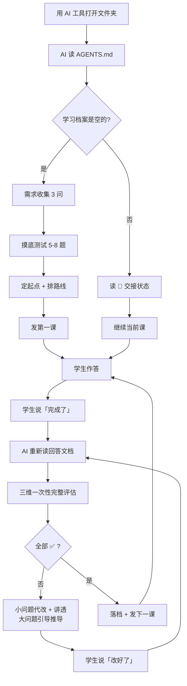

# 演示学科 · 5 分钟跑通全流程

> **这是一个示例，不是课程。** 目的是让你在 5 分钟内看懂「这个文件夹怎么用」。
> 看完可以整个删掉 `示例/` 目录，不影响任何东西。

---

## 为什么有这个演示

第一次打开这个文件夹的人都会问：「所以我要干嘛？」

答案：**把这个文件夹用 AI 工具打开，然后跟它说话。** 就这么简单。

下面用一个虚构学生「小 A 想学 Python」演示完整流程。

---

## 第 1 步 · 用 AI 工具打开这个文件夹

见 [`../../教程/01-五分钟上手.md`](../../教程/01-五分钟上手.md)。

关键：**打开的是文件夹本身**，不是某个文件。

---

## 第 2 步 · 说第一句话

```
我是学生，请先读 AGENTS.md，然后开始。
```

AI 会读 [`../../AGENTS.md`](../../AGENTS.md) → 发现 `我的学习/00-学习档案.md` 是空的 → 进入**需求收集**。

> 💡 如果 AI 说「我读不到规则」，说明你用的工具没开那个开关。
> 见 [`../../教程/02-各工具接入指南.md`](../../教程/02-各工具接入指南.md)。

---

## 第 3 步 · AI 会问你 3 个问题

| 它问 | 小 A 回答 |
|---|---|
| 你为什么学 Python？ | 想自动处理 Excel，工作要用 |
| 以前接触过吗？ | 完全没碰过 |
| 目标是什么？ | 能自己写脚本批量改 Excel |

AI 把这些写进 `我的学习/00-学习档案.md` 的 📋 学生信息。

---

## 第 4 步 · 摸底测试（约 10 分钟）

AI 按 [`../../协议/01_摸底剧本.md`](../../协议/01_摸底剧本.md) 出 5–8 题，**一次最多发 3 题**。

小 A 是零基础，第 1 题就卡住了 → AI 给提示 → 还是不会 → 跳过。

**摸底结论**：

```
✅ 摸底结论：起点是 L1 零基础。
   - 已具备：会打开 Excel、知道什么是单元格
   - 需要补：变量、循环、文件读写
   - 建议从：第 1 课「变量与数据类型」开始
   - 预计 8 课能到「写出批量改 Excel 的脚本」
```

写进 `我的学习/学科/Python/00-摸底测试.md`。

> **注意**：摸底结果**不贴标签**。AI 不会说「你基础很差」，只会说「从哪开始」。

---

## 第 5 步 · 排路线 + 发第一课

AI 排前 5 课，写进 `我的学习/学科/Python/00-课程路线.md`，然后发第 1 课：

```
我的学习/学科/Python/01-变量与数据类型/
├── 01_教学引导.md    ← AI 写的讲解 + 5 道题
└── 01_学生回答.md    ← 小 A 在这里作答
```

AI 会告诉你：「在 `01_学生回答.md` 里作答，做完跟我说『完成了』。」

---

## 第 6 步 · 小 A 作答

打开 `01_学生回答.md`，在每题的围栏里写答案。

**小 A 的答案（故意写错两处）**：

```python
# 问题 3：把两个数相加并打印
a = 5
b = 3
print(a + b)

# 问题 4：判断一个数是正数还是负数
num = -2
if num > 0:
    print("正数")
else:
    print("负数")

# 问题 5：循环打印 1 到 5
for i in range(5):
    print(i)
```

写完发一句：「**完成了**」。

---

## 第 7 步 · AI 评估（这是最关键的一步）

AI 会**重新读文件**（不是凭记忆），然后**一次性**评估全部题目：

| 题号 | 概念理解 | 逻辑正确 | 语法可编译 | 结论 |
|------|----------|----------|-----------|------|
| 3 | ✅ | ✅ | ✅ | 通过 |
| 4 | ✅ | ✅ | ✅ | 通过 |
| 5 | ✅ | ⚠️ | ✅ | **有问题** |

**问题 5 的三段式讲解**：

```
## 1️⃣ 问题 5：循环范围错了

**你的原答案**：
for i in range(5):
    print(i)

**问题在哪里**：
- range(5) 产生 0,1,2,3,4 —— 从 0 开始，到 4 结束（**不含 5**）
- 题目要求打印 1 到 5，所以输出会是 0~4，少一个 5、多一个 0
- 这是 Python 的「左闭右开」约定，初学者最容易踩的坑

**我改成**：
for i in range(1, 6):
    print(i)
```

> **这就是「小问题直接代改」**：AI 改了文件，同时把「为什么」讲透了。
> 不是只回一句「已修改」——那是这个项目的反面样例。

---

## 第 8 步 · 复评 + 落档 + 发下一课

小 A 说「改好了」→ AI **再次读文件** → 复评通过 → 落档：

1. `01_学生回答.md` 末尾填上「最终复评结果」+「正确答案与解析」
2. `我的学习/00-学习档案.md` 改三处：🚦 交接状态 / 📊 掌握表 / ⏳ 待办表
3. 发第 2 课

---

## 完整流程图



---

## 这个演示想让你记住的 4 件事

1. **你只需要说两句话**：「我是学生，开始」和「完成了」。
2. **AI 一定会重新读文件**，不靠记忆——这是硬规则。
3. **小问题它直接帮你改**，并把「为什么错」讲透，不让你白答一轮。
4. **状态只写在三个地方**（🚦 / 📊 / ⏳），所以随时关掉、随时回来都能接上。

---

## 现在轮到你了

删掉这个 `示例/` 目录，然后：

```
我是学生，请先读 AGENTS.md，然后开始。
```
